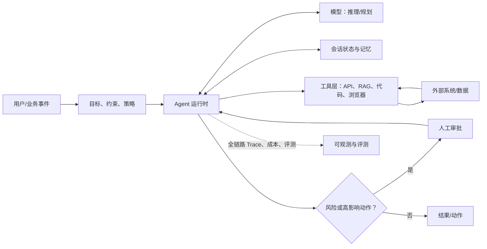

# AI Agent 开发知识体系与 GitHub 学习地图

> 面向已经会调用 LLM API、希望系统进入 Agent 开发的人。目标不是记住所有框架，而是建立一套可迁移的工程能力：即使框架替换，也能设计、验证和上线可靠的 Agent。
>
> 最后核对：2026-09-04。本文优先收录官方组织、协议维护组织和得到广泛采用的开源项目；GitHub Star 不是权威性的唯一依据。

## 0. 先建立正确的全景图

**Agent = 在明确目标与约束下，模型通过“感知 → 决策 → 调用工具 → 观察结果 → 继续/停止”的循环完成任务的系统。**

它不是“更长的 Prompt”，也不等同于多 Agent。一个能可靠完成单一闭环、可以追踪和评测的单 Agent，通常比未经验证的多 Agent 系统更有价值。



系统能力可拆成八层；这也是学习和代码评审时的检查清单。

| 层 | 核心问题 | 必须掌握的产物 |
| --- | --- | --- |
| 1. 模型与提示 | 模型何时推理、何时输出结构化结果？ | system prompt、JSON Schema、few-shot、上下文预算 |
| 2. Agent loop | 何时继续、重试、降级、停止？ | 最大步数、超时、错误分类、终止条件 |
| 3. 工具 | 如何让模型安全、准确地调用真实能力？ | 小而清晰的工具、类型定义、幂等键、权限边界 |
| 4. 状态与记忆 | 哪些信息只在本轮有效，哪些需要持久化？ | session state、checkpoint、用户记忆、知识库 |
| 5. 编排 | 何时用确定性工作流、路由或子 Agent？ | 状态机/图、handoff 契约、并发与汇聚策略 |
| 6. 协议与集成 | 如何连接工具和其他 Agent？ | MCP server/client、A2A Agent Card、鉴权 |
| 7. 可靠性与安全 | 如何防注入、越权和误操作？ | 最小权限、审批、sandbox、审计日志 |
| 8. 评测与运营 | 如何知道它真的变好且成本可控？ | golden dataset、离线 eval、trace、线上指标 |

## 1. 必读 GitHub 仓库：按学习目标而非“框架热度”选择

### A. 先学工作流与运行时（选一个作为主线）

| 推荐度 | 仓库 | 适合学什么 | 何时作为主线 |
| --- | --- | --- | --- |
| 必学 | [openai/openai-agents-python](https://github.com/openai/openai-agents-python) | Agent、tools、handoff、guardrail、session、tracing 的最小原语；示例和文档结构清晰 | 想用较少抽象理解 Python Agent runtime，或使用 OpenAI/兼容 Chat API |
| 必学 | [anthropics/claude-cookbooks · patterns/agents](https://github.com/anthropics/claude-cookbooks/tree/main/patterns/agents) | Prompt chaining、routing、并行化、orchestrator-workers、evaluator-optimizer 等通用模式的最小实现 | 不绑定框架，先理解为什么/何时需要一个模式 |
| 强烈推荐 | [langchain-ai/langgraph](https://github.com/langchain-ai/langgraph) | 有状态图编排、checkpoint、human-in-the-loop、长任务恢复 | 工作流长、状态复杂、要容错和可恢复执行 |
| 按生态选择 | [google/adk-python](https://github.com/google/adk-python) | Agent、runner、session、memory、工作流、工具确认和评测/部署一体化 | Google/Gemini/Vertex 生态，或希望学习多语言 ADK |
| 按生态选择 | [microsoft/agent-framework](https://github.com/microsoft/agent-framework) | Python/.NET、多 Agent 工作流、中间件、durability、治理 | .NET/Azure/Microsoft Foundry 生态或企业工作流 |
| 用于理解本质 | [huggingface/smolagents](https://github.com/huggingface/smolagents) | CodeAgent 与 ToolCallingAgent 的取舍、极少抽象的多步 loop | 想读懂 Agent 核心实现，或探索 code-as-action |

**不要并行精通所有框架。**建议先读 Anthropic 的模式示例，再从上表选一个主线完成项目；第二个框架只用于做同一项目的 1 个小型对照实现。框架代码会变，以上八层不会消失。

> 迁移提醒：历史上影响很大的 [microsoft/autogen](https://github.com/microsoft/autogen) 已处于 maintenance mode；新项目宜优先考察其后继的 Microsoft Agent Framework。AutoGen 仍适合阅读经典多 Agent 对话模式，但不宜作为新项目唯一押注。

### B. 互操作：把“会调用工具”升级为可集成系统

| 概念 | 权威仓库 | 你要带走的结论 |
| --- | --- | --- |
| MCP（Model Context Protocol） | [modelcontextprotocol/modelcontextprotocol](https://github.com/modelcontextprotocol/modelcontextprotocol)、[python-sdk](https://github.com/modelcontextprotocol/python-sdk) | MCP 解决**模型/Agent 如何发现并使用工具、资源、提示**；从 client、server、tools、resources、authorization 开始读。不要把不可信 MCP server 当成安全组件。 |
| A2A（Agent2Agent） | [a2aproject/A2A](https://github.com/a2aproject/A2A)、[a2a-samples](https://github.com/a2aproject/a2a-samples) | A2A 解决**独立 Agent 如何发现能力、协商输入输出、管理任务并协作**。它与 MCP 互补：一个 Agent 可经 A2A 委派，再在内部通过 MCP 调工具。 |
| 可复用 Agent 行为 | [anthropics/skills](https://github.com/anthropics/skills) | 把特定领域的流程、约束、工具使用准则打包为可版本化的技能；重点学习“把经验变成可审查资产”，而非复制某个格式。 |

### C. 生产工程：可观测、评测、安全缺一不可

| 领域 | GitHub 起点 | 先学到什么 |
| --- | --- | --- |
| Trace / LLMOps | [langfuse/langfuse](https://github.com/langfuse/langfuse)、[Arize-ai/phoenix](https://github.com/Arize-ai/phoenix) | 将一次用户请求串成 trace：模型调用、检索、工具输入输出、耗时、token、异常与最终动作；可回放失败轨迹。两者均支持开放式集成，任选其一落地即可。 |
| 评测方法与基准 | [openai/evals](https://github.com/openai/evals)、[gaia-benchmark/GAIA](https://github.com/gaia-benchmark/GAIA)、[THUDM/AgentBench](https://github.com/THUDM/AgentBench) | 区分“通用研究基准”和“你的业务验收集”。真正决定能否上线的是后者。阅读基准的任务定义、判分和失败案例，而不要只看 leaderboard。 |
| 应用安全 | [OWASP/www-project-top-10-for-large-language-model-applications](https://github.com/OWASP/www-project-top-10-for-large-language-model-applications) | 围绕 prompt injection、敏感信息泄漏、不安全输出、过度授权、供应链等建立威胁模型。 |

## 2. 推荐阅读顺序：从原理到可上线系统

### 阶段 1：一个可靠的 Tool-using Agent（第 1 周）

目标：实现一个“查询订单/知识库后生成建议”的单 Agent；不接入真实写操作。

1. 读 [OpenAI Agents SDK 的核心原语](https://github.com/openai/openai-agents-python) 和 [Anthropic Agent patterns](https://github.com/anthropics/claude-cookbooks/tree/main/patterns/agents)。前者看 runtime，后者看模式。
2. 手写而非先上框架：消息循环、`max_steps`、工具 schema、工具执行器、错误返回、最终响应。
3. 为每个工具写清楚：用途、入参 schema、返回 schema、权限、超时、是否可重试、是否幂等。
4. 输出必须先经过结构化解析/校验；模型文本不得直接拼接成 SQL、Shell、URL 或写操作。

验收：为 20 个代表性输入录制预期结果；工具参数合法率、任务完成率和平均步数均可被统计。

### 阶段 2：状态、记忆、RAG 与工作流（第 2 周）

目标：将上周系统变成有会话、可恢复且可控的业务流程。

1. 区分四种数据：本轮上下文、会话状态、长期用户偏好、外部事实知识库。不要把它们都塞进 prompt。
2. 给 workflow 加状态机：`planned → executing → awaiting_approval → completed/failed`；每个状态都有可序列化数据与明确转移条件。
3. 接入 RAG 时单独评测“召回内容是否相关/是否允许回答”，不要把检索失败误判为模型能力差。
4. 需要长运行与人工介入时，再用 LangGraph/ADK/MAF 的 checkpoint 与 HITL 能力实现同一个状态图。

验收：中断后能从 checkpoint 恢复；重复调用不会产生重复副作用；无资料时能明确说“不知道”并给出下一步。

### 阶段 3：协议化集成与多 Agent（第 3 周）

目标：把一项外部能力做成 MCP 工具，再实现一个有边界的 specialist 委派。

1. 先实现 MCP tool server/client，做好 tool allowlist、鉴权、输入校验、审计。
2. 子 Agent 是一种**成本更高的工具调用**：为它写 capability contract（输入、输出、权限、预算、截止时间、失败语义）。
3. 只在任务可自然拆分、子任务可并行或需要明显不同上下文/权限时使用多 Agent；否则用确定性代码或单 Agent routing。
4. 需要跨团队/跨平台的独立 Agent 协作时，再研究 A2A 的 Agent Card、Task 与 Artifact。

验收：主 Agent 能解释委派给谁、拿到了什么以及失败时如何降级；子 Agent 无权访问未授予的工具或数据。

### 阶段 4：评测、安全与上线（第 4 周）

目标：从“Demo 可用”变成“能安全灰度”。

1. 建立 50–100 条业务 golden set，按正常、边界、对抗、工具异常、拒答/转人工分层。
2. 接入 Langfuse 或 Phoenix 之一，采集 trace、成本、延迟、工具错误、模型/提示/工具版本。
3. 使用离线回归集做发布门禁；线上灰度只允许低风险动作，高风险动作默认审批。
4. 按 OWASP 项目进行威胁建模和演练，尤其是从网页/RAG/MCP 返回的非可信文本诱导工具调用的场景。

验收：每次 prompt、模型、工具或编排变更都能重跑评测并比较差异；事故可从 trace 复盘到具体工具调用和版本。

## 3. 模式选择指南：先选最简单可行模式

| 需求信号 | 优先方案 | 不要过早做 |
| --- | --- | --- |
| 固定业务步骤、合规流程 | 确定性工作流 + 仅在局部调用 LLM | 让 Agent 决定所有分支 |
| 请求类别不同 | Router → 专用 prompt/工具 | 多 Agent 群聊 |
| 独立子任务可同时做 | 并行 worker + 明确汇聚器 | 无边界地复制上下文给每个 worker |
| 产物可被明确质量规则检查 | Generator → evaluator → bounded retry | 无限自我反思循环 |
| 长时任务、有中断或人工审核 | 状态图 + checkpoint + HITL | 把全程 state 只存内存 |
| 一个专家拥有独立工具/上下文 | Handoff 或 Agent-as-tool | 为每个小功能单独建 Agent |
| 跨组织/跨运行时协作 | A2A | 把 A2A 当作本地函数调用的替代品 |

`bounded retry` 的含义是：固定最大尝试次数、每次失败有结构化原因、达到上限后转人工/降级，而不是让模型“再试一次直到成功”。

## 4. 生产级最小架构与数据契约

```text
Request
  └─ Policy gate（鉴权、限流、风险分类、租户隔离）
      └─ Orchestrator（状态机、预算、最大步数、停止条件）
          ├─ Model（计划/结构化决策）
          ├─ Context service（会话、记忆、RAG）
          ├─ Tool gateway（schema 校验、allowlist、RBAC、幂等、审计）
          └─ Human approval（高风险/不可逆/越权操作）
      └─ Response / Action

Every span → Trace store（prompt、模型版本、工具版本、参数、耗时、成本、结果、错误）
Offline dataset → Eval runner → 发布门禁
```

每个工具最少应拥有下列契约。缺一项就先补齐，再开放给模型。

```yaml
name: create_refund_draft
purpose: 仅创建退款草稿；不能提交或打款
input_schema: {order_id: string, reason_code: string}
output_schema: {draft_id: string, status: enum[drafted, rejected], reason: string}
authorization: orders:refund_draft
side_effect: reversible
idempotency_key: required
timeout_seconds: 10
retry: only_on_network_error
approval: required_before_submit
audit_fields: [actor_id, order_id, draft_id, trace_id]
```

## 5. 评测体系：别只测最终文案

| 测试层 | 要验证什么 | 示例指标 |
| --- | --- | --- |
| 单元测试 | 工具实现和 schema | 参数校验通过率、幂等性、权限拒绝正确率 |
| 组件测试 | 检索、路由、结构化输出 | recall@k、路由准确率、JSON 合法率 |
| 轨迹测试 | Agent 是否按正确过程行动 | 正确工具序列率、越权工具调用率、平均步数 |
| 端到端业务评测 | 用户任务是否达成 | task success、事实正确性、人工 rubric 得分 |
| 安全评测 | 注入/越权/泄露能否被拦住 | attack success rate、策略拦截率 |
| 线上运营 | 是否稳定、便宜、可恢复 | p95 延迟、成本/成功任务、失败率、转人工率 |

建议把每条测试样本保存为：`input + 已知上下文 + 期望动作/输出 + 风险标签 + 评分函数`。模型更新、prompt 改动、工具 schema 改动和编排改动都必须重跑。LLM-as-a-judge 很有用，但应混合确定性规则、人工抽样和业务结果，避免“模型给模型打分”成为唯一真相。

## 6. 安全红线（上线前逐项确认）

- 把来自用户、网页、RAG 文档、MCP/A2A 对端的内容都视为**不可信数据**，绝不把它们原样提升为系统指令。
- 模型没有直接的数据库、Shell、支付或生产发布权限；所有动作经工具网关并执行 schema、RBAC、作用域和租户校验。
- 高风险、不可逆、金额相关、涉及个人数据或跨边界操作必须二次确认；确认页面应展示**实际参数**，不是模型摘要。
- 工具写操作需要幂等键、速率限制、超时和审计；第三方 API token 采用短期、最小范围凭证。
- 代码执行/浏览器/文件系统放入隔离环境，网络出口、挂载目录和可用命令均须 allowlist。
- 不记录不必要的敏感 prompt、工具参数或原始文档；trace 需脱敏、分级访问和保留策略。
- 将“预算耗尽、循环过长、外部服务超时、模型拒答”设计为正常失败路径，而不是异常后继续无限重试。

## 7. 一个可执行的 30 天练习项目

选择你真实工作中低风险但有价值的流程，例如“研发知识问答 + 工单草稿”或“数据分析请求 → SQL 草稿 → 人工确认后执行”。不要从能自动付款/发布/删库的任务开始。

| 周次 | 交付物 | 完成定义 |
| --- | --- | --- |
| 第 1 周 | 单 Agent + 2 个只读工具 + 20 条样本 | 工具 schema 完整；所有调用在 trace 中可见 |
| 第 2 周 | 状态图 + RAG/会话 + checkpoint | 可中断恢复；无依据时拒答或澄清 |
| 第 3 周 | MCP 工具服务 + 一个 specialist | 明确权限、预算与委派契约；可注入失败并正确降级 |
| 第 4 周 | 50–100 条 golden set + 安全测试 + 灰度开关 | 变更可回归；高风险动作必须审批；有回滚方案 |

推荐仓库结构：

```text
agent-app/
├── agent/                 # prompt、编排、状态机
├── tools/                 # 每个工具的 schema、实现和单测
├── policies/              # 权限、审批、预算、脱敏策略
├── evals/
│   ├── datasets/          # golden cases（版本化）
│   ├── scorers/           # 规则/LLM/人工 rubric
│   └── regression/        # CI 可运行回归
├── observability/         # trace 初始化、字段规范
└── docs/
    ├── threat-model.md
    ├── tool-contracts.md
    └── runbook.md
```

## 8. 框架选择的简明结论

1. **还没有做过完整 Agent：**先用 OpenAI Agents SDK 或自己写最小 loop，并以 Anthropic cookbook 学模式。优先建立评测和工具契约。
2. **需要有状态、可恢复的长流程：**选 LangGraph；将业务路径先画成状态图再编码。
3. **Google/Gemini 或 Microsoft/.NET 是既定平台：**分别优先 ADK 或 Microsoft Agent Framework，减少集成和运维摩擦。
4. **要接入外部工具生态：**把 MCP 当为工具集成规范，而不是某个框架的功能；跨独立 Agent 再考虑 A2A。
5. **准备上线：**框架选择之后，最先投入的是 trace、golden set、权限和审批，而不是继续增加 Agent 数量。

## 9. 延伸资料与可信度说明

- [OpenAI Agents SDK](https://github.com/openai/openai-agents-python)：其 README 将 Agent、Tools、Handoffs、Guardrails、Sessions 与 Tracing 列为核心概念；OpenAI 官方也将 Agents SDK 与 Responses API、内置工具和可观测性视为 Agent 的构建模块。[官方说明](https://openai.com/index/new-tools-for-building-agents/)
- [LangGraph](https://github.com/langchain-ai/langgraph)：重点能力是 durable execution、human-in-the-loop、memory 和调试/部署，适合学习状态性 Agent 的工程要求。
- [Google ADK](https://github.com/google/adk-python) 与 [Microsoft Agent Framework](https://github.com/microsoft/agent-framework)：均提供官方维护、面向生产的 Agent/工作流实现；前者强调 code-first、工具确认和评测，后者支持 Python/.NET 与流程治理。
- [MCP 规范](https://github.com/modelcontextprotocol/modelcontextprotocol) 和 [A2A 规范](https://github.com/a2aproject/A2A)：两者不是竞争关系。前者连接工具/数据，后者连接独立 Agent；A2A 的规范附录明确说明了这种互补分工。
- [Langfuse](https://github.com/langfuse/langfuse)、[Phoenix](https://github.com/Arize-ai/phoenix)：均把 trace、实验/数据集、评测作为 AI 工程闭环的一部分。不要只依赖聊天记录定位线上问题。
- [OWASP LLM/GenAI 项目](https://github.com/OWASP/www-project-top-10-for-large-language-model-applications)：它是威胁建模的起点；具体控制必须依据你自己的数据、权限和动作风险设计。

---

### 每次设计 Agent 时的 10 个问题

1. 这是不是一个应由确定性代码完成的工作流，而非 Agent？
2. 成功、失败和停止分别如何定义？
3. 模型究竟需要哪些工具？每个工具的最小权限是什么？
4. 哪些内容不可信，如何避免它们影响指令或权限？
5. 哪些状态需要持久化、多久后删除、由谁可读？
6. 哪些动作不可逆或影响他人，如何展示真实参数并请求审批？
7. 超时、重试、重复请求、外部系统出错时会发生什么？
8. 用什么数据集证明它比改动前更好？
9. 线上出现错误时，能否从 trace 复盘到模型、prompt、工具和版本？
10. 如果模型不可用或预算耗尽，系统如何安全降级？
