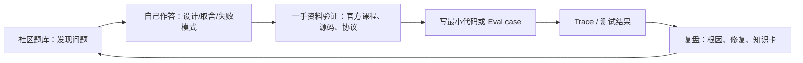

# AI Agent 题库驱动学习与排错路线

> 场景：以题目为入口，系统建立 Agent 开发能力，同时准备 AI Engineer / Agent 开发岗位面试。本文不是题目堆砌：每道题都要求你给出设计取舍、失败模式和可验证的实践证据。
>
> 资料最后核对：2026-09-04。生态变化很快，涉及框架 API、模型能力和协议版本时，必须回到对应官方仓库/文档确认。

## 先说结论：有题库，但要分层使用

GitHub 上确实有持续补充的 Agent 面试题和问题分析项目；但**专门题库通常由个人或社区维护，不能单独充当“正确答案”**。更稳妥的方法是把它们作为出题器，再用官方课程、源码、评测场景库和 issue/discussion 来校验答案。



你最终需要训练的不是“背出 ReAct 的定义”，而是下面这种回答能力：

> “这个需求我会先用确定性状态机包住可预测步骤，只让模型负责意图识别和受约束的工具选择。工具通过 schema、RBAC、幂等键和审批网关执行。离线会测工具选择与完整轨迹，线上记录 trace；若失败，先排除评测/基础设施问题，再定位检索、路由、工具或策略。”

## 1. GitHub 来源清单与可信度分工

### 1.1 题目来源：用来发现知识盲点

| 项目 | 内容与适合程度 | 使用方式 | 注意事项 |
| --- | --- | --- | --- |
| [spawn08/agentic-ai-interview-kit · 题库目录](https://github.com/spawn08/agentic-ai-interview-kit/tree/main/docs/interview-questions) | 题目实际位于 `docs/interview-questions/`：基础、架构、模式、框架、代码和行为/场景六类 | **新个人题库**：按其章节抽题，再完成本文的实践任务 | 目前只有少量提交、star 和公开讨论，**不属于社区活跃或权威项目**；所有结论必须回查一手资料 |
| [Nareshedagotti/AI-Engineer-Interview-QA · Agentic AI](https://github.com/Nareshedagotti/AI-Engineer-Interview-QA/blob/main/Agentic_AI_Interview_Questions.md) | Agent 定义、架构、规划、记忆、工具、多 Agent、可靠性等快问快答 | **口述练习库**：用 2 分钟解释一个概念 | 不要把“一个标准答案”当成工程结论；其中框架/API 可能随版本漂移 |
| [WeThinkIn/AIGC-Interview-Book](https://github.com/WeThinkIn/AIGC-Interview-Book) | 中文大规模 AIGC/LLM/Agent 面试资料，含 Agent 基础和高频题目录 | **中文补充库**：补 LLM、RAG、工程基础 | 覆盖广而非专注 Agent；按目录挑题，避免无差别刷题 |

### 1.2 验证与问题分析来源：用来纠正“会背不会做”

| 项目 | 为什么优先 | 你从中抽什么题 |
| --- | --- | --- |
| [microsoft/ai-agents-for-beginners](https://github.com/microsoft/ai-agents-for-beginners) | 官方课程，覆盖基础、模式、工具、Agentic RAG、评测、MCP/A2A、记忆、框架、生产、安全；带代码样例和 smoke test | “何时用 Agent？”“工具如何设计？”“如何从本地 Demo 部署到有评测、监控和审批的服务？” |
| [microsoft/ai-agent-eval-scenario-library](https://github.com/microsoft/ai-agent-eval-scenario-library) | 面向真实 Agent 行为的测试场景，包含工具选择、缺参数、错误处理、多步流程、诊断与升级 | “回答看似正确但工具没被调用，怎么测？”“用户参数不全时 Agent 应如何做？” |
| [microsoft/triage-and-improvement-playbook](https://github.com/microsoft/triage-and-improvement-playbook) | 将 eval 失败分为评测设置、Agent 配置、平台限制，并给出排查路径 | “70% 通过率该改 prompt 还是改 eval？”“如何避免修复幽灵问题？” |
| [microsoft/agent-framework](https://github.com/microsoft/agent-framework)、[langchain-ai/langgraph](https://github.com/langchain-ai/langgraph)、[openai/openai-agents-python](https://github.com/openai/openai-agents-python) | 活跃的一手 runtime / 编排实现；以 README、examples、issues 和 release 为准 | “状态如何持久化？”“handoff 与 Agent-as-tool 的边界？”“如何做 HITL、trace、durability？” |
| [modelcontextprotocol/modelcontextprotocol](https://github.com/modelcontextprotocol/modelcontextprotocol)、[a2aproject/A2A](https://github.com/a2aproject/A2A) | MCP 和 A2A 的规范与样例是协议问题的权威基线 | “MCP 与 A2A 分别解决什么？”“不可信远端 Agent/工具如何处理？” |
| [OWASP LLM/GenAI Top 10](https://github.com/OWASP/www-project-top-10-for-large-language-model-applications) | Agent 安全问题的威胁建模起点 | “Prompt injection 到底会造成什么副作用？”“怎样最小化过度授权？” |

### 1.3 如何判断一个“及时题库”值得跟

每月花 5 分钟检查，而非盲目订阅所有仓库。

| 检查项 | 通过信号 | 红旗 |
| --- | --- | --- |
| 最近活动 | 最近 30–90 天有内容型 commit、issue/PR 讨论或 release | 只改 README 徽标，核心题目多年不变 |
| 可验证性 | 每个主题能指到官方文档、源码、论文或可运行案例 | 答案只有营销词或“使用某框架即可” |
| 版本意识 | 标注框架/协议/API 版本和迁移说明 | 仍把已废弃 API 当推荐路径 |
| 失败视角 | 有工具失败、注入、权限、评测、成本和观测问题 | 只有 Happy-path Demo 与定义题 |
| 社区质量 | issue/PR 有具体讨论，维护者愿意修正 | star 很高但没有维护、没有讨论、没有代码验证 |

**当前推荐的组合**：以本文的 48 题和微软课程为系统主线；`agentic-ai-interview-kit` 仅作为补充题库；用评测场景库和 triage playbook 做“真实问题分析”。中文题目则从 AIGC-Interview-Book 定向补充。

## 2. 使用方式：一题四答，不接受空泛定义

为每道题建立如下学习卡。答不完整就标记为“未掌握”，不要直接看标准答案。

```yaml
question: 用户说“帮我取消订单”，Agent 应如何执行？
one_sentence: 先确认订单与取消资格，再以受控工具执行，并展示真实结果。
design: [读取订单, 校验资格, 缺参澄清, 明确确认, 幂等取消, 呈现结果]
failure_modes: [错订单, 未确认就取消, 重试导致重复操作, 工具超时, 模型伪造成功]
evidence: [工具 schema 单测, 轨迹测试, 负向工具调用测试, trace]
sources: [题库链接, 评测场景链接, 自己的代码/PR]
status: 未答 | 能口述 | 能实现 | 能排错
```

推荐节奏（每天 60–90 分钟）：

1. 不看答案，口述回答 2 道题，每题限 3 分钟。
2. 对照一手资料，补齐遗漏的约束、失败模式和指标。
3. 每天选 1 道题，写最小代码、测试或 trace 分析，而不是继续刷 20 道题。
4. 周末复盘：把本周所有“答不上来/答得空泛”的问题归为模型、工具、状态、编排、评测或安全之一。

## 3. 题库驱动主线：48 道核心题

每一模块 8 题。完成某模块的“实践关”后再进入下一模块；否则知识会停留在术语层。

### 模块 A：边界与基础（Q01–Q08）

| # | 面试/设计题 | 高质量回答必须包含 | 实践关 |
| --- | --- | --- | --- |
| Q01 | 什么是 Agent？与单次 LLM 调用差在哪？ | 目标、状态、循环、工具、环境反馈、停止条件；不把“多轮聊天”自动等同于 Agent | 写一个最多 3 步的 tool-use loop |
| Q02 | 哪些需求不应使用 Agent？ | 固定流程、低容错、高风险、成本/延迟不值得时用确定性代码或表单 | 为 3 个业务需求写 Agent/非 Agent 决策表 |
| Q03 | 一个生产 Agent 的最小组件有哪些？ | model、instructions、state、tools、policy、runtime、observability、eval | 画出自己的 8 层架构图 |
| Q04 | 如何定义任务成功、失败和停止？ | 业务验收条件、最大步数/预算/超时、失败分类、降级/升级路径 | 为一个任务写状态机和终止条件 |
| Q05 | 为什么 Prompt 不是业务逻辑的唯一载体？ | 不确定性、不可测试性、权限与副作用需在代码/策略层保证 | 将一个“禁止退款”要求迁到工具权限层 |
| Q06 | Structured output 为什么重要？ | 约束模型输出、解析/校验、驱动分支；仍需服务端验证 | 对 5 个模型输出做 JSON Schema 校验 |
| Q07 | Agent 成本由哪些部分组成？ | 输入上下文、输出、推理、工具、检索、重试、并行、人工介入 | 记录一条任务的 step/token/工具耗时 |
| Q08 | Demo 与生产 Agent 最大差别是什么？ | 身份、权限、数据、可恢复性、评测、监控、安全、运维 | 列一份 Demo→生产差距清单 |

实践资料：[AI Agents for Beginners · Intro](https://github.com/microsoft/ai-agents-for-beginners/tree/main/01-intro-to-ai-agents)、[Agentic AI Interview Kit · foundations](https://github.com/spawn08/agentic-ai-interview-kit)。

### 模块 B：工具、循环与可靠性（Q09–Q16）

| # | 面试/设计题 | 高质量回答必须包含 | 实践关 |
| --- | --- | --- | --- |
| Q09 | 好工具的 schema 如何设计？ | 单一职责、清晰名称/描述、强类型、可枚举值、小入参、结构化错误 | 为 `get_order` 和 `cancel_order` 设计两个独立 schema |
| Q10 | 如何防止模型调用错误工具？ | 精简工具集、描述区分、工具路由、allowlist、负向测试、澄清而非猜测 | 为每个工具加入 1 条“不应调用”测试 |
| Q11 | 用户参数不全时怎么办？ | 在调用前收集必填参数；区分 required/optional；处理歧义值 | 测试“我要取消订单”时先问订单号 |
| Q12 | 工具有副作用，如何避免重复执行？ | 幂等键、状态查询、确认、事务/补偿、重试分类 | 连续两次同请求只能产生一次动作 |
| Q13 | 工具超时或返回 500 时如何处理？ | 结构化错误、可重试性、退避、向用户说明、部分成功、转人工 | 模拟 timeout 并验证无堆栈/密钥泄露 |
| Q14 | 如何避免 Agent 无限循环？ | step/token/time budget、循环检测、明确 final/abort、人工接管 | 人为制造工具重复失败并验证停止 |
| Q15 | 何时让 Agent 写代码调用工具，何时使用 JSON tool calling？ | 代码适于复杂数据处理/组合；JSON 更容易受控；二者均需要 sandbox 和权限 | 对同一任务分别实现两种方案并比较 trace |
| Q16 | 模型说“已完成”但并未调用工具，怎么避免？ | 以工具事件/后端状态为真相；响应必须来自已验证结果；评测工具轨迹 | 写一条“文案正确但未调用工具”的失败测试 |

实践资料：[Tool & Connector Invocations 场景库](https://github.com/microsoft/ai-agent-eval-scenario-library/blob/main/capability-scenarios/tool-and-connector-invocations.md)、[OpenAI Agents SDK](https://github.com/openai/openai-agents-python)。

### 模块 C：上下文、RAG 与记忆（Q17–Q24）

| # | 面试/设计题 | 高质量回答必须包含 | 实践关 |
| --- | --- | --- | --- |
| Q17 | context、session state、long-term memory、RAG 的边界？ | 本轮推理、任务/会话状态、用户偏好/历史、外部事实知识的不同生命周期与读写规则 | 画数据流并标出每类数据的 TTL |
| Q18 | Agentic RAG 与普通 RAG 有何不同？ | 检索是否由 Agent 决策、迭代检索/工具选择、轨迹评测；不等于“更多检索” | 同题比较固定 RAG 与可选检索路线 |
| Q19 | 如何避免陈旧或无关文档影响结果？ | 数据版本/权限/更新时间、metadata filter、rerank、引用、无依据拒答 | 在过期文档混入时验证拒答或注明限制 |
| Q20 | 什么是上下文工程？ | 选择、压缩、排序和隔离 context；预算管理；不只是“写更长 prompt” | 设定 8k token 预算并说明保留/丢弃逻辑 |
| Q21 | 如何评测 RAG 和 Agent 的问题分别出在哪？ | 召回、grounding、回答、工具选择、轨迹分层度量 | 将一个错误分别归因到 retriever 和 agent |
| Q22 | 长期记忆为什么有安全与隐私风险？ | 错误记忆污染、跨用户泄漏、注入持久化、可删除性、写入审批 | 给 memory 写入增加 user scope 与 review |
| Q23 | 如何处理长任务的上下文膨胀？ | summarization、checkpoint、artifact、分层状态、按需检索 | 运行 20 步模拟任务且不无限增长 prompt |
| Q24 | 什么时候应该澄清、拒答或转人工？ | 信息不足、证据冲突、权限/风险边界、无法恢复的失败 | 为三种行为各写 3 条 eval case |

实践资料：[AI Agents for Beginners · Agentic RAG](https://github.com/microsoft/ai-agents-for-beginners/tree/main/05-agentic-rag)、[Context engineering lesson](https://github.com/microsoft/ai-agents-for-beginners/tree/main/12-context-engineering)、[Memory lesson](https://github.com/microsoft/ai-agents-for-beginners/tree/main/13-agentic-memory)。

### 模块 D：编排、多 Agent 与协议（Q25–Q32）

| # | 面试/设计题 | 高质量回答必须包含 | 实践关 |
| --- | --- | --- | --- |
| Q25 | ReAct、plan-and-execute、router、workflow 的取舍？ | 可预测性、并行度、任务开放度、失败恢复、成本；优先最简单方案 | 把同一需求分别画成 router 与状态图 |
| Q26 | 为什么很多多 Agent 系统反而更差？ | 上下文复制、协调成本、无所有权、循环、不可观测、成本/延迟放大 | 把两个子 Agent 合并，比较质量/成本 |
| Q27 | 何时使用 subagent / handoff / Agent-as-tool？ | 能力边界、控制权转移、输入输出契约、权限/预算、失败语义 | 写一个 specialist 的 capability contract |
| Q28 | 如何设计多 Agent 的共享状态？ | source of truth、不可变 artifact、并发冲突、版本与 checkpoint、最小共享 | 让两个 worker 只通过 versioned artifact 协作 |
| Q29 | 如何防止子 Agent 重复劳动或互相覆盖？ | 任务不可重叠、清晰 owner、依赖图、汇聚器、取消机制 | 为 research/writer/reviewer 画任务图 |
| Q30 | MCP 与 A2A 各解决什么？ | MCP：工具/资源/提示接入；A2A：独立 Agent 发现、委派和任务协作；二者互补 | 实现一个只读 MCP tool，写出 A2A 何时才需要 |
| Q31 | 外部 MCP server 或 A2A peer 可以信任吗？ | 默认不可信；验证身份、数据隔离、输入清洗、最小权限、审计 | 给外部工具加 allowlist 和假数据测试 |
| Q32 | 如何把人放进工作流？ | 审批点基于风险、真实参数展示、超时/拒绝、恢复状态、审计 | 在“提交取消”前实现 approval state |

实践资料：[LangGraph](https://github.com/langchain-ai/langgraph)、[MCP 规范](https://github.com/modelcontextprotocol/modelcontextprotocol)、[A2A 规范](https://github.com/a2aproject/A2A)。

### 模块 E：评测、可观测与问题分析（Q33–Q40）

| # | 面试/设计题 | 高质量回答必须包含 | 实践关 |
| --- | --- | --- | --- |
| Q33 | 为什么不能只看最终回答评测 Agent？ | 结果可蒙对；需测工具选择、参数、顺序、轨迹、副作用、延迟和成本 | 写 1 条 output pass/trajectory fail 的 case |
| Q34 | 如何构建业务 golden set？ | 正常、边界、对抗、缺参、失败、拒答、转人工；期望动作与评分器 | 为一个业务 Agent 写 30 条分层样本 |
| Q35 | deterministic eval 与 LLM-as-judge 如何分工？ | schema/权限/工具/关键字段用确定性；语义与质量可用 judge；需校准和人工抽样 | 用两种方法评分同一批 10 题并比较分歧 |
| Q36 | 通过率 80% 能上线吗？ | 取决于风险、频率、fallback、具体质量信号；安全/合规不应被平均分掩盖 | 为低/中/高风险 Agent 写门槛 |
| Q37 | 如何定位一次失败：eval、Agent 还是平台？ | 先检查测试期望/评分器和基础设施，再看 trace、配置、模型/平台限制 | 用失败日志给 5 个 case 分类并指定 owner |
| Q38 | Trace 至少应记录什么？ | request/tenant、prompt/model/version、检索、工具入出参（脱敏）、状态转移、耗时、token、成本、错误、审批 | 画出一条任务的 span tree |
| Q39 | 如何做回归与灰度？ | 版本化数据集、CI gate、shadow/canary、回滚、线上反馈转 eval | 为 prompt 改动设计一次发布流程 |
| Q40 | 线上指标如何避免被“平均值”误导？ | 按任务类型/风险/工具/租户分段；p95、失败原因、转人工、成本/成功任务 | 为 dashboard 列出 8 个分段指标 |

实践资料：[Eval Scenario Library](https://github.com/microsoft/ai-agent-eval-scenario-library)、[Triage & Improvement Playbook](https://github.com/microsoft/triage-and-improvement-playbook)、[Langfuse](https://github.com/langfuse/langfuse) 或 [Phoenix](https://github.com/Arize-ai/phoenix)。

### 模块 F：安全、上线与系统设计（Q41–Q48）

| # | 面试/设计题 | 高质量回答必须包含 | 实践关 |
| --- | --- | --- | --- |
| Q41 | Prompt injection 的本质是什么？ | 不可信内容试图改变优先级/策略；不是靠关键词过滤即可解决 | 将恶意网页/RAG 文档作为输入进行红队测试 |
| Q42 | 如何防止 Agent 过度授权？ | 工具网关、RBAC/ABAC、scope、审批、只读默认、分离凭据 | 让阅读 Agent 无法触发写工具 |
| Q43 | 为什么模型输出不能直接执行 SQL/Shell/HTTP？ | 输出不可信、注入/越权/副作用；需 parameterize、schema、sandbox、allowlist | 证明非法参数被服务端拒绝 |
| Q44 | 如何安全处理代码执行和浏览器自动化？ | sandbox、网络/文件挂载/命令 allowlist、短期凭据、HITL、审计 | 制定并验证一个最小 sandbox policy |
| Q45 | 如何保障多租户与敏感数据？ | tenant isolation、检索 ACL、数据最小化、脱敏 trace、保留/删除策略 | 设计跨租户检索的负向测试 |
| Q46 | 如何设计长任务的恢复与补偿？ | checkpoint、task id、幂等、Saga/补偿、部分成功、人工接管 | 模拟第 3 步失败后恢复且不重复副作用 |
| Q47 | 如何同时优化质量、成本和延迟？ | 先测量；路由、缓存、缩小工具集/上下文、并行、模型分级；避免只看 token | 提出 3 个优化并用指标验证副作用 |
| Q48 | 面试要求设计“自动退款 Agent”，怎么答？ | 从澄清 scope、风险分级、状态机、工具契约、审批、eval、trace、灰度、回滚完整展开 | 用第 5 节模板完成 10 分钟系统设计 |

实践资料：[OWASP LLM/GenAI Top 10](https://github.com/OWASP/www-project-top-10-for-large-language-model-applications)、[AI Agents for Beginners · Securing Agents](https://github.com/microsoft/ai-agents-for-beginners/tree/main/18-securing-ai-agents)。

## 4. 六类必须会分析的真实问题

这部分比纯面试题更接近真实工作。每次碰到问题先写假设，再读 trace 和测试结果；不要先改 Prompt。

| 现象 | 先问什么 | 常见根因 | 首选修复与验证 |
| --- | --- | --- | --- |
| 回答说“已提交”，后台没有记录 | 有没有 tool event？是否只是文本看似正确？ | 伪造成功、工具未触发、路由错误 | 以工具事件/后端状态为判据；加入 trajectory eval 和负向测试 |
| 取消了错误订单 | 订单 ID 从哪来？用户是否确认？重试是否重复？ | 参数提取错误、缺确认、无幂等 | 先读取/回显真实对象，再审批；idempotency key；测试相似订单 |
| RAG 回答“有理有据”但内容错误 | 召回了什么？文档版本/权限/时间是否正确？ | chunk/metadata/filter/rerank 失败；模型超出证据推断 | 分开评测 retrieval 和 grounded answer；要求引用；无证据拒答 |
| 多 Agent 比单 Agent 慢、贵且不稳定 | 子任务是否真正独立？谁拥有状态？ | 无意义拆分、上下文复制、无预算和汇聚契约 | 合并 Agent 或改为确定性状态机；比较 task success/成本/p95 |
| Eval 红了但人工看回答没问题 | 期望答案仍正确吗？评分器稳定吗？依赖是否健康？ | 错误 rubric、关键词过窄、LLM judge 方差、测试环境问题 | 先校准评分器；用 5–10 条人工金标复核，再改 Agent |
| 模型读到网页后尝试越权调用工具 | 不可信内容是否与系统指令混杂？工具策略在何处执行？ | prompt injection、工具权限过宽、无 action gate | 标记不可信数据；工具网关执行权限；对高风险参数二次确认 |

排错顺序可固定为：

```text
0. 基础设施健康吗？（API、索引、凭据、限流、版本）
1. Eval 本身有效吗？（期望、评分器、样本、环境）
2. 轨迹在哪一步偏离？（检索、路由、工具、状态、审批）
3. 是 Agent 配置可修、工具/数据可修，还是平台限制？
4. 修复后重跑同一 case + 相邻负向 case，防止局部优化造成回归。
```

这与 [微软的 Failure Triage 决策树](https://github.com/microsoft/triage-and-improvement-playbook/blob/main/triage-decision-tree.md) 的思路一致：先排除基础设施和评测问题，再归因到 Agent 配置或平台限制。

## 5. 面试系统设计题模板：以“自动退款 Agent”为例

遇到开放题时，按此顺序回答，能把“框架名堆砌”变成工程方案。

1. **澄清范围**：什么能自动处理？退款金额上限？是否需要身份验证？是否允许取消已发货订单？
2. **成功与风险**：正确退款、错误退款、重复退款、泄露订单信息分别是什么后果？为每类定义指标。
3. **最小流程**：`识别意图 → 收集/核验订单 → 查询资格 → 呈现金额与政策 → 审批 → 提交退款 → 核验结果`。固定步骤用代码，模型只做理解、澄清和受限选择。
4. **工具契约**：`get_order`、`check_refund_eligibility`、`create_refund_draft`、`submit_refund` 分离；各有 schema、RBAC、超时、幂等、审计字段。
5. **状态与恢复**：持久化 task、order、eligibility、draft、approval、submission 状态；恢复时查询后端而非重复 submit。
6. **安全**：订单按用户/租户 scope 查询；外部文本不影响策略；金额高于阈值、异常退款或不可逆动作进入人工审批。
7. **评测**：覆盖正确订单、缺订单号、相似订单、无资格、工具失败、重复请求、注入、审批拒绝、部分成功。评测工具序列和后端结果，不只看回答。
8. **可观测/上线**：trace 关联 `task_id`、`order_id`（脱敏）、工具事件和版本；先 shadow/小比例灰度；安全门禁失败则 block；有 kill switch 与回滚。

回答时可补一句取舍：**初版不需要多 Agent**。退款是高风险、流程相对固定的业务，状态机 + 单 Agent 澄清层通常更可控；只有在独立、低耦合的专长任务出现时再引入 specialist。

## 6. 六周执行计划

| 周 | 题目范围 | 必须提交的证据 | 推荐仓库 |
| --- | --- | --- | --- |
| 1 | Q01–Q08 | 单 Agent loop、设计边界表、20 条基础样本 | ai-agents-for-beginners + interview kit |
| 2 | Q09–Q16 | 2 个工具、schema 单测、缺参/负向/失败测试、trace | eval scenario library |
| 3 | Q17–Q24 | RAG/会话状态设计、知识更新/无依据案例、30 条样本 | beginner course + LangGraph/ADK 任选 |
| 4 | Q25–Q32 | 状态图、MCP 只读工具、specialist 契约、审批节点 | MCP / A2A spec |
| 5 | Q33–Q40 | golden set、eval runner、失败日志、发布门槛 | scenario library + triage playbook |
| 6 | Q41–Q48 | 威胁模型、红队案例、10 分钟系统设计录音/文稿 | OWASP + 目标框架源码 |

每周结束时，用下面的评分而不是“看完了多少题”判断是否过关：

| 维度 | 0 分 | 1 分 | 2 分 |
| --- | --- | --- | --- |
| 概念 | 不能解释 | 能背定义 | 能说清边界与取舍 |
| 实现 | 无代码 | 有 Happy-path Demo | 有工具/状态/错误处理 |
| 验证 | 没测 | 只看回答 | 有轨迹、负向和回归测试 |
| 排错 | 直接改 prompt | 能提出猜想 | 能据 trace 归因并复验 |
| 安全 | 未考虑 | 有泛泛 guardrail | 权限/审批/sandbox 在执行层落地 |

总分低于 7/10 时，不要进入下一模块；从本周失败题重新做一个最小案例。

## 7. 建议保存到自己仓库的学习目录

```text
agent-study/
├── question-cards/          # 每题一份四答卡
├── labs/                    # 小型、可运行的验证代码
├── evals/
│   ├── datasets/            # golden / adversarial / failure cases
│   ├── scorers/
│   └── results/             # 版本化结果摘要（原始敏感数据除外）
├── traces/                  # 脱敏后的关键失败 trace
├── incidents/               # 根因、修复、回归测试
├── threat-model.md
└── framework-watchlist.md   # 关注仓库、最后核对日期、版本影响
```

`framework-watchlist.md` 至少记录：仓库链接、关注的 release/issue、最后核对日期、与你项目相关的 breaking change、要重跑的 eval。这样题库的“及时性”会转化为你自己的更新机制，而不是焦虑来源。

## 8. 开始顺序（今天就能做）

1. 如需补充刷题，可访问 [Agentic AI Interview Kit 的题库目录](https://github.com/spawn08/agentic-ai-interview-kit/tree/main/docs/interview-questions)，但先只做 Q01–Q08，不要跳到多 Agent。
2. 在本地新建 `question-cards/Q01.md`，用“一题四答”模板写完 Q01。
3. 实现一个只有 `get_weather` 或 `get_order` 的只读 Agent loop，限制为 3 步并记录 trace。
4. 用 [工具调用场景库](https://github.com/microsoft/ai-agent-eval-scenario-library/blob/main/capability-scenarios/tool-and-connector-invocations.md) 写三条测试：正确调用、缺参数不调用、信息问答不调用。
5. 等以上三条都能证明通过后，再看框架的抽象层与多 Agent。

---

### 快速复盘问题

当你看到任意一个新的 Agent 题目、框架或社区案例，先问：

1. 它解决的是模型、工具、状态、编排、评测还是安全中的哪一层？
2. 它在什么条件下比确定性代码更好？代价是什么？
3. 它最可能怎样失败？我如何观测、测试、恢复和回滚？
4. 它的结论是否依赖特定框架/版本？对应的一手来源在哪？
5. 我能否在 30 分钟内用一个最小实验验证，而不是只相信示例？
