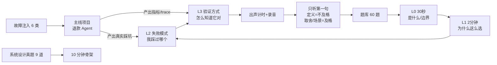

# AI Agent 面试备战工作区

> 建立日期：2026-09-04　|　方法版本：v1
>
> 这不是一份阅读材料，是一个**训练场**。阅读产生不了「面试时能说出来」的能力，出声计时说一遍才能。

## 默认假设（可改）

搭建时按以下三个默认值配置。要调整，改这里，我再重排题库权重。

| 项 | 默认值 | 影响 |
| --- | --- | --- |
| 题库结构 | **60 题重配比** | 补齐了 LLM 基本功（10 题）和推理/服务基础设施（8 题）两块空白 |
| 主线项目 | **带审批的订单取消/退款 Agent** | 所有 L2（真实踩坑）答案的素材来源，对应 Sierra / Scale AI 真题形态 |
| 目标岗位 | **国外大厂 AI/Agent 工程岗，6–8 周** | 基础设施题权重较高；术语按英文准备，表达可中英双轨 |

## 核心方法（一句话）

**一个贯穿主线项目产出真实素材 → 每题按面试官的三层追问链准备 → 出声计时训练表达。**

## 目录说明

| 路径 | 用途 | 谁来填 |
| --- | --- | --- |
| [方法论.md](方法论.md) | 三层追问、三种表达长度、节奏安排 | 已写好，读一次 |
| [背诵稿/00-背诵方法.md](背诵稿/00-背诵方法.md) | **怎么背、两周节奏、什么能背什么不能背** | 已写好，先读这个 |
| `背诵稿/A~G-*.md` | 60 题的**口语逐字稿**，L0/L1 直接背 | 已写好，出声练 |
| [评分标准.md](评分标准.md) | 每题的过关判据 + 周度自评表 | 已写好，用来打分 |
| [题库/00-总表.md](题库/00-总表.md) | 60 题清单 + 状态跟踪 | **你每天更新状态** |
| `题库/A~G-*.md` | 每题的考察点 + 四层采分点 | 已写好，是**判卷标准**不是答案 |
| [系统设计/骨架.md](系统设计/骨架.md) | 套 80% 系统设计题的 10 分钟结构 | 已写好，背下来 |
| [系统设计/真题清单.md](系统设计/真题清单.md) | 9 道带公司归属的真题 | **你每周讲一道并录音** |
| [主线项目/README.md](主线项目/README.md) | 项目规格、里程碑、题目映射 | **你写代码，我按里程碑验收** |
| [故障注入/清单.md](故障注入/清单.md) | 6 类故障演练 + 假设记录表 | **你注入，写「假设 vs 真因」** |
| `答题卡/` | 你自己的 L0–L3 答案 | **你写**，用 `_模板.md` |
| [来源清单.md](来源清单.md) | 仓库活跃度对照 + 复核日期 | 每月复核一次 |
| `日志/` | 每日打卡 + 周度复盘 | **你每天一行** |

## 两条路线，按你现在的状态选

### 路线一 · 先背后练（时间紧、想快速到基础水平）

1. 读 [背诵稿/00-背诵方法.md](背诵稿/00-背诵方法.md)（5 分钟），搞清**什么能背什么不能背**。
2. 打开 [背诵稿/C-背诵稿.md](背诵稿/C-背诵稿.md)，出声读 Q19 的 30 秒逐字稿三遍，然后遮住稿子看骨架复述一遍。
3. 按两周节奏推进：**D1–D7 全 60 题的 L0，D8–D11 补 L1**，两周后你已经不哑火。
4. 同步起 [主线项目](主线项目/README.md) 的 M0，把 L2 的素材槽逐步填上。

> ⚠️ **L2 不要背别人的经历。** 稿子里的「📝 素材槽」是留给你自己数字的，没有的时候用「🔻 降级话术」——诚实降级不扣分，编造被追问会穿帮。

### 路线二 · 边练边补（时间充裕、要冲高分）

1. 读完 [方法论.md](方法论.md)，理解 L0–L3。
2. 打开 [题库/00-总表.md](题库/00-总表.md)，用**出声计时**过 Q19–Q22 的 L0，超时的标 `未掌握`，答不上来的再去翻背诵稿。
3. 主线项目和故障注入并行推进，产出真实的 L2。

> 两条路线共同的规则：**第一周只做 L0，全 60 题过一遍。** 不要在 Q19 停下来做深度。
