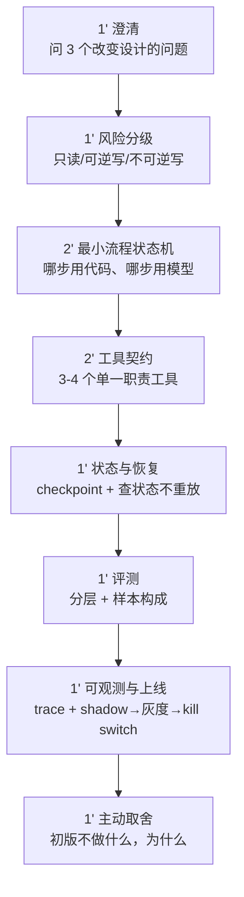

# 10 分钟系统设计骨架

> 这一套能套住 80% 的 Agent / RAG 系统设计题。**先把它背到能不看提示讲完**，之后任何新题都是填空。
>
> 评分见 [评分标准.md](../评分标准.md#三系统设计题评分10-分钟)，满分 16。

## 时间分配



---

## 第 1 段 · 澄清（1 分钟）

**必问三个，且要让面试官感觉到答案会改变你的设计。**

1. **自动化边界**：哪些情况必须转人工？有没有金额/类型的上限？
2. **失败代价谁承担**：做错了是公司赔钱、用户受损、还是只是体验差？（这决定后面所有的严格程度）
3. **约束**：延迟要求？成本预算？现有系统有哪些接口可用？

> 加分句式：「如果失败代价是公司直接赔付，我会把不可逆动作全部加审批；如果只是体验问题，我会用事后可撤销代替事前审批——所以我先确认这一点。」

**不要问**：「用什么模型？」「用哪个框架？」这类问题不改变设计。

---

## 第 2 段 · 风险分级（1 分钟）

把所有动作分成三档，**每档配不同策略**。这一段是最容易拿分也最容易被跳过的。

| 档 | 例子 | 策略 |
| --- | --- | --- |
| **只读** | 查订单、查政策、答疑 | 自动执行，只做资源级鉴权 |
| **可逆写** | 建草稿、改偏好、加备注 | 自动执行 + 可撤销 + 事后通知 |
| **不可逆写** | 退款、发消息、取消订单 | **幂等 + 审批网关 + 审计**，超阈值必须人工 |

> 加分句式：「我先按可逆性而不是按业务重要性分档，因为可逆性决定了我能不能承受模型出错。」

---

## 第 3 段 · 最小流程状态机（2 分钟）

画出流程，并**显式指出哪一步用代码、哪一步用模型**。这是分辨「懂 Agent」和「会用 Agent」的地方。

```
识别意图 → 收集/核验对象 → 查询资格 → 呈现结果与政策 → 审批 → 执行 → 核验结果
   模型        模型+代码        代码        代码         人      代码      代码
```

**要说的三句话**：
1. 「固定步骤用代码，模型只负责**意图识别、参数澄清、受约束的工具选择**。」
2. 「模型不进入控制流的部分，我用状态机保证可预测和可恢复。」
3. 「每个状态都有明确的终止条件和失败分类。」

---

## 第 4 段 · 工具契约（2 分钟）

**3–4 个单一职责的工具**，不要一个万能工具。每个都要说到这五项：

```
get_<对象>                 只读   schema | RBAC | 超时
check_<资格>               只读   schema | RBAC | 超时
create_<动作>_draft        可逆   schema | RBAC | 超时 | 审计
submit_<动作>              不可逆 schema | RBAC | 超时 | 幂等键 | 审计 | 审批前置
```

**要说的三句话**：
1. 「拆成读和写两类，读 Agent 的工具集里根本没有写工具。」
2. 「不可逆的那个带幂等键，键在任务创建时生成一次，重试复用。」
3. 「错误结构化返回 `{code, retryable, user_message}`，不把内部信息给模型。」

---

## 第 5 段 · 状态与恢复（1 分钟）

**要说的三句话**：
1. 「持久化任务状态机：task_id、对象 id、资格结果、草稿、审批状态、执行结果。」
2. 「**恢复时查后端真实状态，不重放动作**——因为超时的步骤可能已经生效了。」
3. 「部分成功是独立的状态值，不归为成功或失败。」

---

## 第 6 段 · 评测（1 分钟）

**要说的三句话**：
1. 「分三层测：**工具选择、完整轨迹、最终后端状态**。只看回答会漏掉『说了做了但没做』。」
2. 「golden set 分层：正常、边界、缺参、**多个相似候选**、工具失败、**应拒绝**、**应转人工**。happy path 不超过 40%。」
3. 「确定性评分做 CI 门禁（工具/参数/权限），LLM judge 只用于语义质量且要校准。」

---

## 第 7 段 · 可观测与上线（1 分钟）

**要说的三句话**：
1. 「trace 关联 task_id、对象 id（脱敏）、工具入出参、**prompt/模型版本**、耗时、token、审批记录。」
2. 「shadow 跑真实流量对比 → 不可逆动作从 1% 灰度 → 有 kill switch 和分钟级回滚。」
3. 「线上指标按任务类型分段看 p95 和 cost per successful task，安全类失败是硬门禁。」

---

## 第 8 段 · 主动取舍（1 分钟）· 别省掉这段

**在面试官问之前主动说。** 这一段的作用是证明你有工程判断力，而不只是会堆组件。

模板：

> 「初版我**不做**多 Agent。这个业务是高风险、流程相对固定的，状态机 + 单 Agent 澄清层更可控。只有当出现真正独立、低耦合的专长任务时我才引入 specialist。
>
> 另外初版我**不做** X，因为它的收益要等到 Y 规模才体现，现在做是过度设计。
>
> 我知道这样的代价是 Z，我会用 W 指标监控它什么时候开始成为瓶颈。」

---

## 常见失分点自查

- [ ] 澄清问题问了但没影响后续设计 → 白问
- [ ] 只画了流程图，没说哪步用模型哪步用代码
- [ ] 工具设计成一个万能 `execute_action`
- [ ] 评测只说「测准确率」，没有分层
- [ ] 全程没说过一次「代价是」「我放弃了」
- [ ] 超时——超时说明骨架没内化，回去掐表重练
