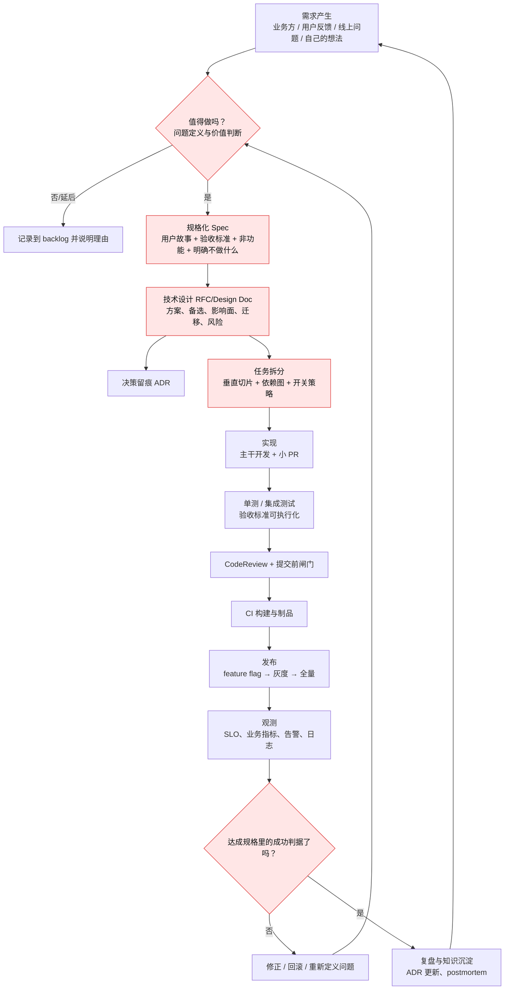
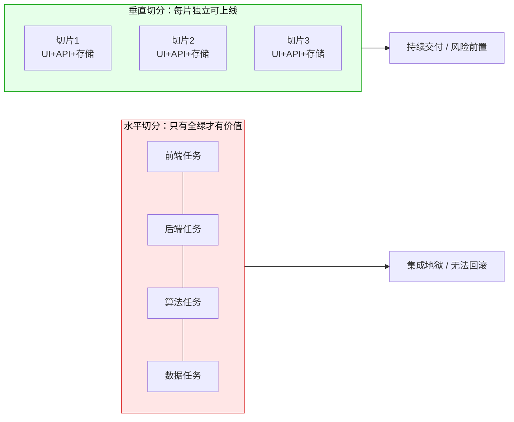
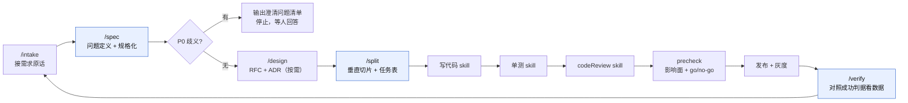

# 从需求到上线：研发流程规范与 GitHub 学习地图

> 面向已经拥有「写代码 / 单元测试 / CodeReview」工具链、但缺少**需求分析与拆分**这一环的开发者。目标不是背下一套方法论，而是补齐一条可执行、可复用、可以交给 AI Agent 承接的链路：**需求产生 → 规格化 → 技术设计 → 任务拆分 → 实现 → 评审 → 发布 → 观测反馈**。
>
> 最后核对：2026-09-04。文中所有链接在写作时实测可访问；优先收录官方组织、被广泛采用的开源流程仓库和有公开产物可读的真实案例。GitHub Star 不作为权威性依据。

## 0. 先给结论：业内没有"唯一标准"，但有四层稳定共识

不存在一份被全行业采纳的「需求到上线」ISO 规范。真实情况是：**流程形态千差万别，但成功的工程组织在四件事上高度一致**。

| 共识层 | 要解决的问题 | 行业标准做法 | 有公开产物可读的代表案例 |
| --- | --- | --- | --- |
| 1. 决策留痕 | 三个月后没人记得为什么这么做 | RFC / Design Doc / ADR | [rust-lang/rfcs](https://github.com/rust-lang/rfcs)、[kubernetes/enhancements](https://github.com/kubernetes/enhancements)、[ADR](https://adr.github.io/) |
| 2. 需求 → 可验证规格 | "做完了"没有客观判据 | 用户故事 + 验收标准 + 契约 + 非功能需求 | [github/spec-kit](https://github.com/github/spec-kit)、[Cucumber BDD](https://cucumber.io/docs/bdd/) |
| 3. 小批量流动 | 大批量交付 = 高风险 + 长反馈 | 垂直切片、主干开发、小 PR、CI/CD、灰度 | [trunkbaseddevelopment.com](https://trunkbaseddevelopment.com/)、[Argo Rollouts](https://github.com/argoproj/argo-rollouts) |
| 4. 反馈闭环 | 上线即失联，需求对错无人知 | SLO / 指标 / 复盘 / DORA | [Google SRE](https://sre.google/sre-book/postmortem-culture/)、[dora.dev](https://dora.dev/) |

**这四层是稳定的，具体框架（Scrum / Shape Up / SAFe / SDD）只是它们的不同包装。** 选框架时先问：它是否强制产出了这四层的产物？

一条完整链路长这样（红框是你目前缺失的部分）：



你已有的 skill 覆盖的是 G / H / I。**本文重点是 B → C → D → F 和 K → M。**

## 1. 你缺的那一环，本质是"三次转换"

"需求分析与拆分"不是写一份文档，而是三次信息形态的转换。每一次转换失败，都有典型症状。

| 转换 | 输入 | 输出 | 失败症状 | 对应实践 |
| --- | --- | --- | --- | --- |
| ① 问题化 | 一句话诉求（"给搜索加个性化"） | 问题陈述：谁、什么场景、什么代价、不做会怎样 | 做出来没人用；上线后才发现解错了问题 | 问题陈述、PR/FAQ、Impact Mapping、Shape Up 的 shaping |
| ② 规格化 | 问题陈述 | 可验证规格：用户故事 + 验收标准（Given/When/Then）+ 非功能预算 + out of scope | "做完了"各说各话；测试无从下手；反复返工 | Example Mapping、BDD、Spec-Driven Development |
| ③ 切分 | 规格 + 技术设计 | 一组**可独立上线**的垂直切片，每片有自己的 DoD 与开关 | 一个月不合并的大分支；集成地狱；无法回滚 | INVEST、垂直切片、SPIDR、Shape Up scope hammering |

一句话记忆：**需求文档的价值不在于"描述"，而在于它把"完成"变成了一个可以被机器和他人客观判定的条件。**

如果只想改一件事，改这个：*每条需求进入开发前，必须能写出至少一条 Given/When/Then 形式的验收标准，以及一句"本次明确不做什么"。*

## 2. 主流流程框架横评：选一个作主线，别都学

| 推荐度 | 框架 / 流程 | 来源与链接 | 它解决什么 | 什么时候选它 |
| --- | --- | --- | --- | --- |
| **必学** | **Spec-Driven Development (Spec Kit)** | [github/spec-kit](https://github.com/github/spec-kit)（有[简体中文 README](https://github.com/github/spec-kit/blob/main/README.zh-CN.md)） | 把"规格"变成驱动 AI 编码的一等产物：宪法 → 规格 → 计划 → 任务 → 实现 → 收敛 | 你已有 AI skill 链，这是与你现状最贴合的一套；可直接抄它的阶段划分 |
| **必学** | **Code-With Engineering Playbook** | [microsoft/code-with-engineering-playbook](https://github.com/microsoft/code-with-engineering-playbook)（[在线阅读](https://microsoft.github.io/code-with-engineering-playbook/)） | 一份完整、免费、端到端的工程规范：敏捷、设计评审、非功能需求、代码评审、测试、CI/CD、可观测、安全 | 想要一份"拿来即用的团队工程规范"底本，逐节裁剪 |
| **必学** | **RFC / Design Doc 流程** | [rust-lang/rfcs](https://github.com/rust-lang/rfcs)、[kubernetes/enhancements](https://github.com/kubernetes/enhancements)、[vuejs/rfcs](https://github.com/vuejs/rfcs)、[python/peps](https://github.com/python/peps) | 变更从提案到接受的公开流程，含模板、评审、状态流转 | 任何"影响面大、方案不止一种"的改动；这是最值得直接抄模板的一类 |
| **强烈推荐** | **ADR（架构决策记录）** | [adr.github.io](https://adr.github.io/)、[joelparkerhenderson/architecture-decision-record](https://github.com/joelparkerhenderson/architecture-decision-record)、[npryce/adr-tools](https://github.com/npryce/adr-tools) | 用几十行记录"为什么这么选"，随代码进仓库 | 立刻可用、成本最低的一项；个人项目也值得 |
| **强烈推荐** | **Shape Up** | [basecamp.com/shapeup](https://basecamp.com/shapeup)（全文免费） | 需求"塑形"、胃口（appetite）代替估算、固定时间可变范围、6 周周期 + 冷却期 | 需求边界模糊、总是延期；想学"怎么把需求砍到能做完" |
| 推荐 | **DDD 建模流程** | [ddd-crew/ddd-starter-modelling-process](https://github.com/ddd-crew/ddd-starter-modelling-process)、[bounded-context-canvas](https://github.com/ddd-crew/bounded-context-canvas)、[aggregate-design-canvas](https://github.com/ddd-crew/aggregate-design-canvas) | 从业务问题到领域模型、限界上下文的可操作步骤与画布 | 业务复杂、模块边界总是划不清 |
| 推荐 | **BDD / Specification by Example** | [cucumber.io/docs/bdd](https://cucumber.io/docs/bdd/)、[cucumber/cucumber](https://github.com/cucumber/cucumber) | 用具体例子澄清需求，验收标准直接变成自动化测试 | 需求歧义多、测试与需求两张皮 |
| 推荐 | **AI 驱动的敏捷交付（BMAD）** | [bmad-code-org/BMAD-METHOD](https://github.com/bmad-code-org/BMAD-METHOD) | 用多角色 Agent（产品、架构、开发、测试）承接从想法到实现，且按变更大小裁剪流程深度 | 想看"多 Agent 分角色做需求分析"的成熟实现范式 |
| 参考 | **GitLab Product Development Flow** | [handbook.gitlab.com](https://handbook.gitlab.com/handbook/product-development-flow/)（站点有人机验证，浏览器打开） | 一家上市公司把"验证轨 + 构建轨"全流程公开的 handbook | 想看真实企业级流程全貌与角色分工 |
| 参考 | **Open Practice Library** | [openpracticelibrary.com](https://openpracticelibrary.com/) | 按"发现 / 选项 / 交付"分类的实践卡片库 | 想按场景查具体实践（如 Event Storming、Impact Mapping） |
| 谨慎 | Scrum / SAFe | — | 仪式与角色定义 | 小团队用 Scrum 的**产物**（DoR/DoD/backlog）即可；SAFe 是大型组织协调方案，个人与小团队引入弊大于利 |

**建议主线：Spec Kit 的阶段划分 + RFC 模板 + ADR + Shape Up 的切分心法。** Microsoft Playbook 作为查阅手册，DDD/BDD 按需补。

### 值得直接抄的三份模板（不用自己发明）

1. **[rust-lang/rfcs 0000-template.md](https://github.com/rust-lang/rfcs/blob/master/0000-template.md)** — 章节本身就是一份优秀的思考提纲：Motivation / Guide-level explanation / Reference-level explanation / Drawbacks / **Rationale and alternatives** / Prior art / **Unresolved questions** / Future possibilities。"备选方案"和"未决问题"这两节，是区分专业设计文档与流水账的关键。
2. **[Kubernetes KEP 模板](https://github.com/kubernetes/enhancements/blob/master/keps/NNNN-kep-template/README.md)** — 比 RFC 更工程化：带元数据（`kep.yaml`）、alpha/beta/GA 分阶段、明确的 Goals / **Non-Goals**、测试计划、升级降级策略，以及一份**生产就绪评审（Production Readiness Review）问卷**，逐条问你"怎么开关、怎么回滚、怎么监控、故障时什么表现"。这是公开可得的最好的上线检查单之一。
3. **[Design Docs at Google](https://www.industrialempathy.com/posts/design-docs-at-google/)** — 解释设计文档的作用、生命周期和何时**不需要**写。

## 3. 一条可落地的端到端流程（8 个阶段 + 进出条件）

以下是把上面共识收敛成的、单人或小团队可直接执行的版本。**每个阶段只定义：产出物 + 进入条件（DoR）+ 完成条件（DoD）。**

### S0 需求接入（Intake）

- **产出**：一条 backlog 记录，含原始诉求原文、来源、提出人、时间。
- **要点**：不要在接入阶段就改写需求。**保留原话**，这是后续澄清歧义的证据。
- **DoD**：能回答"谁提的、什么时候、原话是什么"。

### S1 问题定义与价值判断

- **产出**：**问题一页纸**（模板见 §5.1）。
- **关键动作**：把"要一个功能"翻译成"要解决的问题"。反复问三次"为什么需要它"。
- **DoD**：写清了 ①谁在什么场景遇到什么问题 ②当前如何绕过 ③不做的代价 ④成功的可观测判据（指标 + 阈值 + 观察窗口）。
- **闸门**：写不出第 ④ 条的需求，不进入 S2。这是拦截"伪需求"最有效的一道闸。

### S2 规格化（Spec）

- **产出**：`spec.md`（模板见 §5.2）——用户故事 + 验收标准（Given/When/Then）+ 非功能预算 + **Out of Scope** + 开放问题。
- **关键动作**：**Example Mapping**：对每条规则，举 2～3 个具体例子；举不出例子的规则说明还没想清楚；例子有分歧的地方就是"开放问题"。
- **DoD**：每条验收标准都可被一个自动化测试判定；开放问题全部有归属人和答复；out of scope 明确成文。

### S3 技术设计（RFC / Design Doc）

- **产出**：`rfc.md`（模板见 §5.3）+ 若干条 `ADR`。
- **触发条件**：满足任一即写——引入新依赖 / 改公共接口或数据模型 / 影响 2 个以上模块 / 有不可逆的数据迁移 / 方案有 2 个以上合理选项 / 预计超过 3 天。否则跳过，直接进 S4。
- **DoD**：写了至少一个**被否决的备选方案**及否决理由；列出影响面（谁调用我、我调用谁）、迁移与回滚路径、测试策略、上线后看哪些指标。

### S4 任务拆分

- **产出**：一组**垂直切片**（详见 §4），每片含标题、验收标准子集、依赖、风险、开关名。
- **DoD**：每个切片都能独立部署到生产（哪怕对用户不可见）；单片工作量 ≤ 1～2 天；不存在"只有全做完才有意义"的切片组。

### S5 实现

- **要点**：主干开发 + 短生命周期分支；未完成能力用 feature flag 包住而不是留在长分支里；提交信息用 [Conventional Commits](https://www.conventionalcommits.org/)。
- **DoD**：验收标准对应的测试先写或同步写；PR 描述里链接 spec 与切片编号。
- **接你的现有能力**：写代码 skill、单测 skill。

### S6 评审与提交闸门

- **要点**：小 PR（经验值：< 400 行改动）；评审关注**是否满足 spec 的验收标准**，而不仅是代码风格。
- **参考**：[Google Engineering Practices](https://google.github.io/eng-practices/)（"代码评审的标准是让代码库整体变好，而非完美"）。
- **接你的现有能力**：codeReview skill、precheck（影响面 + 逻辑评审 + go/no-go）。

### S7 发布

- **产出**：发布检查单（模板见 §5.7）+ 灰度计划。
- **要点**：开关先行 → 内部/1%/10%/全量；每一档定义**观察指标与回滚阈值**；回滚路径必须在上线前验证过，而不是出事时现想。
- **工具**：[OpenFeature](https://openfeature.dev/)、[Unleash](https://github.com/Unleash/unleash)、[Argo Rollouts](https://github.com/argoproj/argo-rollouts) / [Flagger](https://fluxcd.io/flagger/)。

### S8 观测与反馈闭环

- **产出**：一次"达成判定"——回到 S1 写下的成功判据，用真实数据判定达成 / 未达成 / 数据不足。
- **要点**：**这一步最常被跳过，但它是整条流程唯一能验证"需求分析做得对不对"的环节。** 未达成时优先怀疑问题定义，而不是加功能。
- **配套**：SLO（[OpenSLO](https://github.com/OpenSLO/OpenSLO)）、无责复盘（[Google SRE Postmortem Culture](https://sre.google/sre-book/postmortem-culture/)、[danluu/post-mortems](https://github.com/danluu/post-mortems) 有大量真实事故报告可读）。

## 4. 需求拆分操作手册（这是最缺、也最能立刻见效的部分）

### 4.1 唯一的核心原则：垂直切，不要水平切

**水平切分（错误）**：按技术层拆成"前端改页面 / 后端写接口 / 算法出模型 / DBA 建表"。
后果：任何一层没完成，整体价值为零；无法独立测试、独立上线、独立回滚；集成风险全部堆到最后。

**垂直切分（正确）**：每片都穿透所有层，交付一个**窄但完整**的能力。
判据一句话：**这一片能不能单独上线？上线后能不能观察到某种真实效果（哪怕只对内部可见）？**



### 4.2 INVEST：切完之后的自检

| 字母 | 含义 | 不满足时的典型表现 |
| --- | --- | --- |
| **I**ndependent | 可独立完成 | 三个切片必须按固定顺序做，且中间不能停 |
| **N**egotiable | 可协商 | 切片写成了实现步骤而非需求，没有取舍空间 |
| **V**aluable | 有价值 | 只有技术意义，说不出对谁有什么用（"重构 service 层"） |
| **E**stimable | 可估算 | 因为存在未知，谁也说不清要多久 → 先拆一个 **Spike**（限时调研） |
| **S**mall | 足够小 | 超过 2 天；PR 超过 400 行 |
| **T**estable | 可测试 | 写不出验收标准 |

### 4.3 常用拆分模式（按顺序试，第一个能用就用）

1. **按工作流步骤拆**：一个长流程先只做主干最短路径（下单 → 支付 → 通知，先只做"下单成功"）。
2. **按业务规则变体拆**：先做默认规则，折扣/黑名单/限购等每条规则一个切片。
3. **按 happy path / 异常路径拆**：先做成功路径，超时、重试、降级各自成片。
4. **按数据类型或来源拆**：先支持一种数据源/一种语言/一种文件格式。
5. **按操作拆（CRUD）**：先只读，再写，再删。
6. **按接口/端拆**：先 API + 命令行可用，再补 Web 界面。
7. **按性能与规模拆**：先做"能跑通"，再做"跑得快"（把性能作为独立切片，带明确的延迟预算）。
8. **抽出 Spike**：不确定性太大时，先做限时（如 4 小时）的技术验证，产出是一份结论而不是功能。

（对应 Mike Cohn 的 SPIDR：Spikes / Paths / Interfaces / Data / Rules。）

### 4.4 完整示例：把"给搜索结果加个性化排序"切成 6 片

这是典型的"一句话大需求"。直接开做 = 一个月大分支 + 无法评估效果。垂直切分后：

| # | 切片 | 用户可见？ | 独立价值 | 开关 | 完成判据 |
| --- | --- | --- | --- | --- | --- |
| 1 | 埋点：记录曝光、点击、停留 | 否 | 没有数据就无法做也无法验证个性化 | `search.tracking` | 日志中可查到完整会话序列，采样率 100%，无性能回退（P99 +<5ms） |
| 2 | 离线基线：用历史日志算出 CTR 基线报表 | 否 | 拿到"不做个性化时的水位"，否则上线后无法判定收益 | 无 | 产出基线报表，指标口径与 §S1 成功判据一致 |
| 3 | 影子计算：线上实时算个性化分数，**只记录不改变顺序** | 否 | 把性能与稳定性风险前置，零业务风险 | `search.rerank.shadow` | 打分服务 P99 延迟 < 预算；错误率 < 0.1%；分数分布落在合理区间 |
| 4 | 1% 灰度：真正改变排序 | 是（1%） | 第一次拿到真实因果效果 | `search.rerank.enabled` | CTR 不降低、延迟在预算内、无投诉；否则一键关闭 |
| 5 | 增加一个信号（如时效性 / 地域） | 是 | 每个信号可独立评估贡献 | 每信号一个开关 | 该信号带来的指标变化可被单独归因 |
| 6 | 全量 + 兜底降级 | 是（100%） | 稳定性收口 | 同 4 | 打分超时/异常时自动回退默认排序，且有演练记录 |

注意三点：
- **切片 1～3 完全不改变用户体验，却承担了绝大部分风险**——这是垂直切分的精髓：不是"先做简单的"，而是**先做能消除最大不确定性的**。
- 每片都有自己的开关和回滚方式。
- 反例（水平切）："算法同学训练模型 / 后端写打分接口 / 前端改展示 / 数据同学建表"——四个月后一次性集成，效果好坏无从归因。

### 4.5 拆分检查清单

- [ ] 每个切片能单独部署到生产吗？
- [ ] 每个切片有自己的验收标准吗？
- [ ] 最大不确定性被安排在**最早**的切片里了吗？
- [ ] 有没有哪片超过 2 天？超过就再拆。
- [ ] 有没有"只有全做完才有意义"的一组切片？有就说明切错了方向。
- [ ] 每个用户可见的切片都有开关和回滚路径吗？
- [ ] 切片之间的依赖是不是一条链？能否改成并行或可乱序？

## 5. 可直接复制的模板

> 建议在仓库里建立 `docs/specs/<需求 slug>/` 目录，放 `problem.md`、`spec.md`、`rfc.md`、`tasks.md`，`docs/adr/` 放决策记录。**这些文件同时是给人看的文档和给 AI Agent 用的长期上下文。**

### 5.1 问题一页纸 `problem.md`

```markdown
# <需求名称>
- 来源 / 提出人 / 日期：
- 原始诉求（保留原话）：

## 谁遇到了什么问题
<角色> 在 <场景> 下，因为 <原因>，导致 <代价>。

## 现在他们怎么绕过
（没有 workaround 的问题往往不是真问题，或者是全新机会——两种情况处理方式不同）

## 不做的代价
（量化：影响多少人 / 多少次 / 多少钱 / 多少时间）

## 成功判据（必填，不可含糊）
- 指标：
- 当前值 → 目标值：
- 观察窗口：
- 数据从哪来：

## 约束
时间 / 人力 / 合规 / 兼容性 / 成本上限
```

### 5.2 规格 `spec.md`

```markdown
# Spec: <名称>
状态：draft | reviewed | approved | shipped
关联：problem.md / rfc.md / issue 链接

## 用户故事
作为 <角色>，我想要 <能力>，以便 <收益>。

## 验收标准
### AC-1 <标题>
Given <前置条件>
When <动作>
Then <可观测的结果>

### AC-2 ...

## 非功能需求（给出数字，不写"要快"）
- 延迟预算：P50 / P99
- 可用性目标：
- 数据规模与增长：
- 成本上限：
- 安全与合规：谁能访问什么数据、保留多久、是否含个人信息

## 边界情况
空值 / 超长 / 并发 / 重复提交 / 权限不足 / 上游超时 / 多语言

## Out of Scope（明确不做）
- 

## 开放问题
| # | 问题 | 归属人 | 期望答复时间 | 结论 |
```

### 5.3 技术设计 `rfc.md`（精简自 Rust RFC + KEP）

```markdown
# RFC: <标题>
作者 / 日期 / 状态

## 动机
要解决的问题，以及为什么现在做。

## 目标 / 非目标
Goals:
Non-Goals:   ← 与 spec 的 out of scope 呼应，防止范围蔓延

## 方案概述
（面向使用者的解释：接口长什么样、用户怎么用）

## 详细设计
数据模型、接口契约、状态流转、并发与幂等、错误语义

## 备选方案与否决理由（必填至少一个）
| 方案 | 优点 | 缺点 | 为什么不选 |

## 影响面
- 上游 / 下游 / 被谁调用
- 数据迁移与兼容：新旧并存期多长、老客户端怎么办
- 回滚路径：怎么回、回滚后数据状态如何

## 风险与缓解

## 测试策略
单测 / 集成 / 契约测试 / 演练（故障注入）

## 上线与观测
灰度节奏、开关名、监控指标、告警阈值、回滚触发条件

## 未决问题
```

### 5.4 决策记录 `docs/adr/0001-xxx.md`

```markdown
# ADR-0001: <决策标题>
状态：proposed | accepted | superseded by ADR-00XX
日期：

## 背景
当时面临的问题与约束（写清"当时"，不要事后美化）

## 决策
我们决定 ...

## 后果
正面：
负面 / 我们接受的代价：
后续需要重新评估的触发条件：
```

一条 ADR 20 行足够。**判断标准：如果这个决定被推翻，需要改动很多代码或影响他人，就值得写一条。**

### 5.5 就绪与完成定义（DoR / DoD）

**Definition of Ready（可以开始做）**
- [ ] 有问题陈述与可量化的成功判据
- [ ] 至少一条 Given/When/Then 验收标准
- [ ] Out of scope 已写明
- [ ] 无 P0 级开放问题（会改变方案选择的问题）
- [ ] 依赖方已知会并确认
- [ ] 已拆成 ≤ 2 天的切片

**Definition of Done（可以说做完了）**
- [ ] 所有验收标准有对应自动化测试且通过
- [ ] CodeReview 通过、提交前闸门通过
- [ ] 文档/ADR 已更新
- [ ] 开关、灰度、回滚路径就位并验证过
- [ ] 监控与告警已配置
- [ ] 已按成功判据回看数据并记录结论

### 5.6 发布检查单（浓缩自 Kubernetes PRR）

- [ ] 如何开启和关闭？关闭后系统行为是什么？
- [ ] 回滚步骤是什么？验证过吗？回滚后数据是否一致？
- [ ] 新增了哪些失败模式？各自的降级行为是什么？
- [ ] 依赖的外部服务不可用时会怎样？超时与重试策略？
- [ ] 资源开销（CPU/内存/QPS/存储/成本）变化多少？
- [ ] 新增哪些监控指标与告警？阈值是多少？
- [ ] 谁在上线后 24 小时内负责看指标？

## 6. 把流程接进你现有的 AI Skill 链

你现在的链路是断的：**需求 →（空白）→ 写代码 → 单测 → CodeReview → precheck → 发布**。
"空白"处的代价是：AI 拿到一句话需求就开始猜，猜错的成本要到 CodeReview 甚至上线后才暴露。

补齐后的目标链路：



### 6.1 两个选择：自建 skill，还是直接用 Spec Kit

| | 直接用 [github/spec-kit](https://github.com/github/spec-kit) | 自建 `/spec` + `/split` skill |
| --- | --- | --- |
| 成本 | 一条命令装好，模板与流程现成 | 需要自己写 2 个 SKILL.md |
| 契合度 | 阶段固定（constitution → specify → plan → tasks → implement → converge），要适应它 | 完全贴合你已有的写代码/单测/codeReview/precheck |
| 适合 | 想先看看"成熟 SDD 长什么样"、新项目 | 已有稳定 skill 链、想无缝衔接 |

**建议：先花半天跑一遍 Spec Kit 的完整流程（哪怕在一个玩具项目上），把它产出的 spec/plan/tasks 文件读一遍，再回来自建。** 你会发现自己要写的 skill 内容已经有了参照样板。它的产物结构、任务编号方式、"收敛（converge）"这一步的设计尤其值得借鉴。

### 6.2 `/spec` skill 的设计要点（需求 → 规格）

```markdown
---
name: spec
description: 把一句话需求转成可验证规格。当用户给出新需求、功能想法、
  业务诉求，或说"分析下这个需求""这个需求怎么做"时使用。产出
  problem.md 与 spec.md，含验收标准、非功能预算、out of scope 与开放问题。
---

# 流程
1. 先复述：用自己的话复述需求，请用户确认理解无误（不确认不往下走）
2. 读代码：在仓库里定位涉及的模块、现有实现与相似功能，避免重复造轮子
3. 问题化：填 problem.md，成功判据必须是可测量的指标 + 阈值 + 观察窗口
4. 澄清：列出开放问题，按 P0（会改变方案）/ P1（会改变实现细节）/ P2 分级
5. 规格化：每条规则举 2～3 个具体例子，把例子写成 Given/When/Then
6. 非功能：延迟、规模、成本、权限与数据合规，必须给数字
7. 明确 out of scope

# 硬性闸门（不满足就停止并要求补充，不要自行假设）
- 成功判据不可测量 → 停
- 存在未解决的 P0 歧义 → 输出问题清单，停
- 任何一条验收标准无法被自动化测试判定 → 重写该条
- 禁止把"实现方案"写进验收标准（AC 描述可观测行为，不描述如何实现）

# 产出
docs/specs/<slug>/problem.md、docs/specs/<slug>/spec.md
```

**最关键的一条设计原则：让 AI 做"提问者"而不是"猜测者"。** 大多数 AI 编码事故的根因不是模型能力不足，而是流程允许它在歧义处自行假设。把"发现 P0 歧义就停下来提问"写成硬性规则，收益极高。

### 6.3 `/split` skill 的设计要点（规格 → 可上线切片）

```markdown
---
name: split
description: 把已批准的 spec 拆成可独立上线的垂直切片与任务表。当用户说
  "拆一下这个需求""怎么分步做""排个实施计划"时使用。
---

# 流程
1. 读 spec.md 与 rfc.md（不存在则先提示走 /spec）
2. 识别最大不确定性（技术风险、性能风险、效果风险），把它排进最早的切片
3. 按模式尝试拆分：工作流步骤 → 业务规则 → happy/异常路径 → 数据类型 →
   CRUD → 接口/端 → 性能，第一个适用的就用
4. 每个切片写：标题、覆盖的 AC 编号、是否用户可见、开关名、完成判据、
   依赖、预计工作量、回滚方式
5. 用 INVEST 自检，超过 2 天的切片继续拆
6. 画依赖图（Mermaid），标出可并行的切片

# 硬性闸门
- 出现按技术层拆分（前端/后端/DB）→ 判为错误，重拆
- 出现"不能独立上线"的切片 → 必须说明理由或重拆
- 用户可见的切片没有开关和回滚方式 → 补上

# 产出
docs/specs/<slug>/tasks.md
```

### 6.4 让规格成为 Agent 的长期上下文

这一步经常被忽略，但收益最大：**把 `docs/specs/` 和 `docs/adr/` 写进 `CLAUDE.md`**，让后续所有 Agent 会话自动带上"这个模块为什么这么设计"的历史。

```markdown
# CLAUDE.md 片段
## 项目约定
- 新需求先走 /spec，产物在 docs/specs/<slug>/
- 架构决策记录在 docs/adr/，改动涉及既有决策时先读对应 ADR
- 实现前必须能指出本次改动对应的 AC 编号
```

效果是：AI 不再每次从零猜测意图，而是在既有决策约束下工作——这也是 Spec Kit 所说的"规格成为可执行产物"的真正含义。

## 7. 四周实操路线

| 周 | 读什么 | 做什么 | 产出 |
| --- | --- | --- | --- |
| **第 1 周：把决策留下来** | [ADR 仓库](https://github.com/joelparkerhenderson/architecture-decision-record)、[Design Docs at Google](https://www.industrialempathy.com/posts/design-docs-at-google/) | 回溯你项目里过去 3 个重要技术决策，各补一条 ADR；建立 `docs/adr/` | 3 条 ADR + 目录结构 |
| **第 2 周：把需求变成规格** | [Spec Kit](https://github.com/github/spec-kit) 跑通一遍、[Example Mapping / BDD](https://cucumber.io/docs/bdd/) | 挑一个手上真实需求，手写 problem.md + spec.md；强迫自己写出成功判据和 out of scope | 1 份完整 spec + 澄清问题清单 |
| **第 3 周：把规格切成片** | [Shape Up](https://basecamp.com/shapeup) 第 1 部分、本文 §4 | 把第 2 周的 spec 拆成垂直切片并**真的按切片交付**，每片一个 PR | tasks.md + 至少 3 个已合并的小 PR |
| **第 4 周：把闭环补上** | [KEP 模板](https://github.com/kubernetes/enhancements/blob/master/keps/NNNN-kep-template/README.md) 的 PRR 部分、[SRE Postmortem](https://sre.google/sre-book/postmortem-culture/)、[dora.dev](https://dora.dev/) | 为一次真实上线写发布检查单、配置开关与灰度、上线后按成功判据回看数据 | 发布检查单 + 一份"达成判定"记录 |

之后再把 §6 的 `/spec`、`/split` 固化成 skill —— **先手工做过两轮再自动化**，否则你写出的 skill 只是把模板复述一遍，缺少真正起作用的那些闸门。

## 8. 怎么知道流程真的变好了

| 类别 | 指标 | 说明 |
| --- | --- | --- |
| 交付效能（[DORA](https://dora.dev/)） | 部署频率 | 越高越好，反映批量大小 |
| | 变更前置时间（提交 → 上线） | 反映流水线与批量 |
| | 变更失败率 | 上线后需要修复/回滚的比例 |
| | 故障恢复时间 | 反映回滚与可观测能力 |
| 需求侧（本文重点） | **需求返工率** | 上线后 2 周内因"需求理解错"产生的改动占比，这是需求分析质量的最直接信号 |
| | **澄清轮次** | 开发过程中回头找提出人确认的次数，应随流程成熟下降 |
| | **切片平均大小** | PR 改动行数中位数，衡量拆分是否到位 |
| | **AC 自动化覆盖率** | 有多少验收标准真的有自动化测试 |
| | **成功判据回看率** | 有多少已上线需求真的做了数据回看，这是闭环是否存在的唯一证据 |

**不要度量**：代码行数、故事点速度（velocity 一旦成为 KPI 就会被通胀）、文档数量。

## 9. 常见反模式对照表

| 反模式 | 表现 | 修正 |
| --- | --- | --- |
| 需求即任务 | 直接把一句话建成任务卡就开工 | 加一道 DoR 闸门：无成功判据不开工 |
| 按技术层拆分 | "前端任务/后端任务/DB 任务" | 垂直切片，见 §4.1 |
| 大爆炸 PR | 一个分支两周、改动 3000 行 | 主干开发 + feature flag，切片 ≤ 2 天 |
| 文档写完即死 | 设计文档与实现早已不符 | 只维护 ADR（决策）与 spec（判据），实现细节交给代码；变更时更新对应 ADR 状态 |
| 只写"要做什么" | 没有 out of scope | 每份 spec 强制写明确不做的部分，这是范围蔓延的主要防线 |
| 验收标准写成实现 | "调用 XX 接口写入 YY 表" | AC 只描述可观测行为 |
| 上线即结束 | 没人回看指标 | S8 定人定时看数据，写下达成判定 |
| AI 一句话直出代码 | 跳过规格，让模型自行假设 | 在 skill 里设硬性闸门：有 P0 歧义必须停下提问 |
| 用 SAFe 治小团队 | 引入大量仪式与角色 | 小团队只取产物：backlog、DoR/DoD、切片、复盘 |

## 10. 延伸资料清单（按用途分类）

**端到端工程规范**
- [microsoft/code-with-engineering-playbook](https://github.com/microsoft/code-with-engineering-playbook) — 免费完整工程手册，含[设计评审](https://microsoft.github.io/code-with-engineering-playbook/design/design-reviews/)与[敏捷实践](https://microsoft.github.io/code-with-engineering-playbook/agile-development/)
- [google/eng-practices](https://github.com/google/eng-practices) — 代码评审标准（作者/评审者双视角）
- [GitLab Handbook · Product Development Flow](https://handbook.gitlab.com/handbook/product-development-flow/) — 企业级全流程公开范本

**需求与规格**
- [github/spec-kit](https://github.com/github/spec-kit) — 规格驱动开发工具链（含中文文档）
- [bmad-code-org/BMAD-METHOD](https://github.com/bmad-code-org/BMAD-METHOD) — 多角色 Agent 承接需求到交付
- [Shape Up](https://basecamp.com/shapeup) — 需求塑形、appetite、固定时间可变范围
- [Cucumber BDD 文档](https://cucumber.io/docs/bdd/) — Example Mapping 与可执行规格
- [Open Practice Library](https://openpracticelibrary.com/) — 实践卡片库
- [User Story Mapping](https://www.jpattonassociates.com/story-mapping/) — 用户故事地图

**设计与决策**
- [rust-lang/rfcs](https://github.com/rust-lang/rfcs) + [模板](https://github.com/rust-lang/rfcs/blob/master/0000-template.md)
- [kubernetes/enhancements](https://github.com/kubernetes/enhancements) + [KEP 模板](https://github.com/kubernetes/enhancements/blob/master/keps/NNNN-kep-template/README.md)（含生产就绪评审问卷）
- [vuejs/rfcs](https://github.com/vuejs/rfcs)、[reactjs/rfcs](https://github.com/reactjs/rfcs)、[emberjs/rfcs](https://github.com/emberjs/rfcs)、[python/peps](https://github.com/python/peps)、[open-telemetry/oteps](https://github.com/open-telemetry/oteps) — 不同规模社区的提案流程对照
- [adr.github.io](https://adr.github.io/)、[architecture-decision-record](https://github.com/joelparkerhenderson/architecture-decision-record)、[adr-tools](https://github.com/npryce/adr-tools)
- [arc42](https://arc42.org/)、[C4 model](https://c4model.com/) — 架构文档与图示模板
- [ddd-crew](https://github.com/ddd-crew/ddd-starter-modelling-process) 系列画布 — 领域建模与边界划分

**契约与接口**
- [OpenAPI Specification](https://github.com/OAI/OpenAPI-Specification) + [Spectral](https://github.com/stoplightio/spectral)（规范 lint）
- [zalando/restful-api-guidelines](https://github.com/zalando/restful-api-guidelines) — 大厂公开的 API 规范范本
- [Pact](https://docs.pact.io/) — 消费者驱动的契约测试

**交付与发布**
- [trunkbaseddevelopment.com](https://trunkbaseddevelopment.com/)、[GitHub Flow](https://docs.github.com/en/get-started/using-github/github-flow)
- [OpenFeature](https://openfeature.dev/)、[Unleash](https://github.com/Unleash/unleash) — 特性开关
- [Argo Rollouts](https://github.com/argoproj/argo-rollouts)、[Flagger](https://fluxcd.io/flagger/) — 渐进式交付
- [Conventional Commits](https://www.conventionalcommits.org/)、[SemVer](https://semver.org/)、[Keep a Changelog](https://keepachangelog.com/)、[release-please](https://github.com/googleapis/release-please)、[semantic-release](https://github.com/semantic-release/semantic-release)
- [12-Factor App](https://12factor.net/)、[SLSA](https://github.com/slsa-framework/slsa)（供应链安全）

**测试与可靠性**
- [Practical Test Pyramid](https://martinfowler.com/articles/practical-test-pyramid.html)、[Testcontainers](https://github.com/testcontainers)
- [Google SRE Book · Postmortem Culture](https://sre.google/sre-book/postmortem-culture/)、[SRE 参与模型（含 PRR）](https://sre.google/sre-book/evolving-sre-engagement-model/)
- [danluu/post-mortems](https://github.com/danluu/post-mortems) — 真实事故报告合集
- [OpenSLO](https://github.com/OpenSLO/OpenSLO)、[dora.dev](https://dora.dev/)

**演进策略**
- [Strangler Fig 模式](https://martinfowler.com/bliki/StranglerFigApplication.html) — 老系统渐进替换
- [Team Topologies · Team API](https://github.com/TeamTopologies/Team-API-template) — 团队与系统边界对齐

### 可信度说明

- Spec Kit、Kubernetes KEP、Rust RFC、Microsoft Playbook、Google SRE、DORA 属于官方组织维护或有大规模长期实践支撑，可放心作为规范来源。
- Shape Up、BMAD、DDD 画布属于**方法论**：思路值得学，不要教条执行，尤其 Shape Up 的 6 周周期高度依赖 Basecamp 的组织形态。
- Scrum/SAFe 相关材料商业培训成分较重，取产物、弃仪式。
- 本文所有流程建议都建立在一个前提上：**你能小步上线**。如果发布一次要走两周审批，先解决发布问题，其余优化收益都会被吃掉。

## 附录：每次接到需求时的 12 个问题

打印出来贴在显示器旁，或直接写进 `/spec` skill 的提问环节。

1. 谁在什么场景下遇到了什么问题？他们现在怎么绕过？
2. 不做会怎样？代价能量化吗？
3. 成功长什么样？哪个指标、涨到多少、看多久？
4. 明确**不做**什么？
5. 输入输出的数据契约是什么？空值、超长、重复、多语言怎么办？
6. 规模多大？QPS、数据量、未来一年增长？
7. 延迟预算、可用性目标、成本上限各是多少？
8. 涉及什么数据？谁有权访问？保留多久？是否含个人信息？
9. 依赖谁、被谁依赖？谁需要同步改动？
10. 老数据、老客户端怎么兼容？回滚路径是什么？
11. 出故障时降级成什么？可接受的最差表现是什么？
12. 谁验收？上线后 24 小时内谁看指标？

**如果第 3、4、12 题答不上来，这条需求还没准备好进入开发。**
