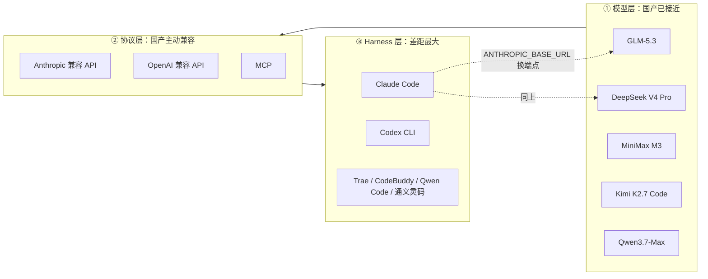

# 国产大模型与 AI 编程能力全景（2026-09）

> 面向已经在用 Claude Code / Codex 做 Agent 开发的人。目标不是"排名"，而是回答三个决策问题：**哪些国产模型现在真的能用在编程和 Agent 场景、买哪个 Plan、什么活儿该继续留给 Claude/GPT。**
>
> 最后核对：2026-09-04。本文数字分两类：**官方一手**（厂商 blog / API 文档 / 定价页，已标注来源）和**二手评测**（媒体、社区横评，标记 ⚠️）。榜单分数波动很快，请把它当"量级参考"而不是"精确值"。

---

## 0. 一句话结论

**2026 年国产模型在"编程主力模型"这一层已经追平到可用线：开源第一梯队（GLM-5.3 / DeepSeek V4 Pro / MiniMax M3 / Kimi K2.7 Code / Qwen3.7）在 SWE-bench Verified 上普遍落在 79%–81%，闭源最强（Claude Opus 4.8 / GPT-5.5）在 88% 左右——差 7–9 个百分点，但价格差 5–15 倍。**

真正的差距不在"单次代码生成质量"，而在三件事上：

1. **长程 Agent 稳定性**——跑 30+ 步、2 小时以上的任务，谁不跑偏、不过度思考、不自我欺骗
2. **Harness（工具外壳）成熟度**——Claude Code / Codex 的上下文管理、子 Agent、权限、checkpoint、hook 生态
3. **工具调用的"手感"**——MCP、多文件编辑、终端交互的一次成功率

国产的打法很明确：**模型开源 + 兼容 Anthropic API + 让你继续用 Claude Code 这个壳**。所以现在最现实的组合往往不是"换工具"，而是**换发动机不换车**。



---

## 1. 玩家版图：谁在做什么

### 1.1 第一梯队 —— 编程/Agent 主力（重点关注）

| 厂商 | 旗舰模型 | 开源 | 上下文 | 定位 |
| --- | --- | --- | --- | --- |
| 智谱 Z.ai | **GLM-5.3**（2026-08-14）/ GLM-5.2 | 开放权重（发布后约两周） | 1M，输出 128K | 编程 + 网络安全，"开源权重最强编程模型" |
| DeepSeek | **DeepSeek-V4-Pro**（1.6T/49B激活）、V4-Flash（284B/13B） | 开源 MoE | 1M（全服务默认） | 极致性价比 + 长上下文基础设施 |
| MiniMax | **MiniMax M3**（2026-06-01） | 开源 | 1M | 国内首个"前沿 Coding + 1M + 原生多模态"三件套 |
| 月之暗面 Kimi | **Kimi K2.7 Code**（2026-08-12，1T/32B激活，384 专家） | 开源 | 256K | 长程编程任务、Agent 工具调用 |
| 阿里通义 | **Qwen3.7-Max**（闭源旗舰）/ Qwen3.6-Plus、Qwen3.7 全系 | 部分开源 | 1M | 生态最全，云 + IDE + CLI 一条龙 |
| 字节 | **Doubao-Seed-Code / Doubao-Seed-2.0-Code** | 闭源 | 256K | 原生兼容 Anthropic API，深度绑定 Trae |

### 1.2 第二梯队 —— 企业/垂直场景

| 厂商 | 模型 | 强项场景 |
| --- | --- | --- |
| 腾讯混元 | Hy3（2026-07，299B / 256K / 192 专家 top-8）；另开源 770B Agent 预览版，1M 上下文 | 代码、办公、金融建模；腾讯云生态、CodeBuddy |
| 百度文心 | ERNIE 5.1 | 搜索增强、中文润色、知识时效性；办公创作与信息检索 |
| 科大讯飞 | 星火 Spark V4.5 | 语音交互、中文数学、教育/医疗；多模态智能座舱（响应延时低至 150ms）|
| 阶跃星辰 / 商汤 | Step 系列 / 日日新 | 多模态、端侧、行业定制 |

> **给 Agent 开发者的取舍**：第二梯队更适合作为"某个具体工具/子任务的模型"（语音、搜索、行业知识），不建议当 coding agent 的主脑。

---

## 2. 能力横评：数字与它们的含金量

### 2.1 编程硬指标（SWE-bench Verified）

| 模型 | SWE-bench Verified | 来源可信度 |
| --- | --- | --- |
| GPT-5.5 | ~88.7% | ⚠️ 二手，且与另一来源冲突 |
| Claude Opus 4.8 | ~88.6% | ⚠️ 二手 |
| DeepSeek V4-Pro-Max | **80.6%** | ⚠️ 二手（官方图表未给文本数字） |
| MiniMax M3 | ~80.5% | ⚠️ 二手 |
| Qwen3.7-Max | ~80.4% | ⚠️ 二手 |
| GLM-5.2 | ~80% | ⚠️ 二手估算 |
| Kimi K2.7 Code | ~79% | ⚠️ 二手估算 |
| Gemini 3.1 Pro | ~80.6% | ⚠️ 二手 |

**怎么读这张表**：国产开源模型全部挤在 **79%–80.6%** 区间，彼此差距 < 2 个百分点，基本在噪声范围内——**不要因为 0.5 分去换模型**。真正的分水岭是与闭源最强的 8–9 分，落到实感上就是"复杂重构 / 陌生大仓 / 多轮失败恢复"时的成功率。

> ⚠️ 注意：SWE-bench Verified 已被广泛刷榜、且各家 scaffold 不一致。同一模型不同来源能差 6 个点（有来源给 Opus 4.8 报 88.6%，另一来源给 ~82%）。**别把它当验收标准，当筛选门槛就行。**

### 2.2 更能反映 Agent 真实水平的榜

MiniMax M3 官方给出的一组（一手数据，可信度较高）：

| Benchmark | MiniMax M3 | 说明 |
| --- | --- | --- |
| SWE-Bench Pro | **59.0%** | 比 Verified 难得多，更接近真实工程 |
| Terminal-Bench 2.1 | **66.0%** | 终端多步操作，考验 Agent loop |
| MCP Atlas | **74.2%** | MCP 工具调用能力 |
| SWE-fficiency | 34.8% | 修改效率（不是只求跑通） |
| KernelBench Hard | 28.8% | 硬核系统级代码 |

Kimi K2.7 Code 官方给出的代际提升（一手）：

| Benchmark | K2.6 | K2.7 Code | 提升 |
| --- | --- | --- | --- |
| Kimi Code Bench v2 | 50.9 | **62.0** | +21.8% |
| Program Bench | 48.3 | **53.6** | +11.0% |
| MLS Bench Lite | 26.7 | **35.1** | +31.5% |

同时官方强调：**长程任务的"过度思考"倾向大幅改善，平均 token 消耗减少约 30%**——这条对 Agent 成本的意义大于榜单分数。

GLM-5.3（一手口径）：与 GLM-5.2 同基座（743B），能力提升**全部来自后训练 scaling**；官方称编程开放权重第一，Terminal-Bench 3.0 开源第一，另外"网络安全能力涌现"。

### 2.3 综合智能指数（Artificial Analysis 口径）

⚠️ 二手汇总，仅供量级参考：

- 开源智能指数：GLM-5.2 ≈ 51（开源第一）> MiniMax M3 ≈ DeepSeek V4 Pro ≈ 44
- Agentic 指数第二梯队：Qwen3.6-Plus ≈ 62、MiniMax-M2.7 ≈ 61、DeepSeek V4 Flash ≈ 61，**大致与 Claude Sonnet 4.6 同档**
- Coding Agent Index：Cursor CLI(Opus 4.7) 61 / Codex(GPT-5.5) 60 / Claude Code(Opus 4.7) 60；**GLM-5.1 以 53 分位列全球第五、国产第一**；Kimi K2.6、DeepSeek V4 Pro 并列第七（50）

**解读**：注意 Coding Agent Index 测的是"模型 + harness"的组合。国产模型接在 Claude Code 这个壳里，分数会比接在自家壳里更好看——这反过来印证了差距主要在 harness。

---

## 3. 订阅计划（Coding Plan）全对比

这是国产厂商 2026 年最激进的地方：**用订阅制把 coding 的边际成本打到几乎为零**。

| 计划 | 档位与月价 | 额度口径 | 主力模型 | 备注 |
| --- | --- | --- | --- | --- |
| **智谱 GLM Coding Plan V2** | Lite ¥118 / Pro ¥538 / Max ¥1078（年付约 7 折） | 积分制：Lite 2000积分/5h、1万/周；Pro 12000/6万；Max 28000/14万 | GLM-5.3（已全量）/ GLM-5.2 | 2026-07-30 起全面开放不限量购买；V1→V2 涨价 2 倍以上 |
| **Kimi Code Plan** | Andante ¥39 / Moderato ¥79 / Allegretto ¥159 / Allegro ¥559（年付月均） | 按套餐 | Kimi K2.7 Code / K3 | 官方预告"高速版"，同模型输出速度约 5–6 倍 |
| **MiniMax 开发者套餐** | Plus ¥49（6亿 token）/ Max ¥119（18亿）/ Ultra ¥469（55亿） | 直接给 token 数 | MiniMax M3 | 官方称"约是 Claude 订阅的 15 倍用量" |
| **阿里百炼 Coding Plan** | 走 API 计费 + Qwen Code CLI | Qwen3.7-Max ¥12/¥36 每百万 token（入/出）；Qwen3.6-Plus 输入低至 ¥2 | Qwen3.7-Plus/Max、Qwen3.6-Plus | 深度绑定阿里云生态 |
| **DeepSeek** | 纯 API，无订阅 | V4-Pro 约 $0.435 入 / $0.87 出 每百万 token；缓存命中 $0.0036 | V4-Pro / V4-Flash | ⚠️ 价格为二手来源，以官网为准 |
| **字节 Doubao** | 火山引擎 API + Trae CN 免费内置 | — | Doubao-Seed-Code | Trae CN 目前可直接免费用 |
| —— 对照组 —— | | | | |
| **Claude Code** | Pro $20 / Max 5x $100 / Max 20x $200 | 5h + 周额度双限 | Opus 4.8 / Sonnet | Pro 含 Claude Code、Cowork、Design、Science |
| **ChatGPT / Codex** | Plus $20 / Pro $200 | Pro 号称不限量 | GPT-5.5 | 功能面更宽（语音、视觉） |

### 3.1 性价比怎么算才对

**不要只比月费，要比"每完成一个任务的成本"。** 三个变量：

1. **单价**：国产便宜 5–15 倍，这是确定的
2. **一次成功率**：国产低 5–10 个百分点 → 重试次数上升
3. **token 消耗**：过度思考的模型会把便宜的单价吃回去（Kimi 明确优化了这一点，值得关注）

粗算：如果国产单价是 1/8，但平均要多试 1.5 次、多烧 1.3 倍 token，实际成本仍是 **约 1/4**。**在"任务本身容错高、你会 review"的场景，国产订阅几乎是白捡的。**

### 3.2 ⚠️ 一个要警惕的信号

GLM Coding Plan 从 V1 到 V2 **Pro 档从 ¥149 涨到 ¥538**（Lite ¥49→¥118，Max ¥469→¥1078）。官方口径是"价格向海外看齐"。这说明：

- **早期的超低价是补贴，不是稳态成本**，做预算不要按 V1 价格线性外推
- 但同时也**开放了不限量购买**，从"抢不到"变成"买得起就有"

---

## 4. 工具链：壳的差距在哪

### 4.1 国产 IDE / CLI 生态

| 工具 | 厂商 | 形态 | 强项 | 短板 |
| --- | --- | --- | --- | --- |
| **Trae / Trae CN** | 字节 | AI 原生 IDE | SOLO 智能体模式（需求拆解→编码→测试全流程）、Builder 一句话生成项目；豆包 + DeepSeek 双引擎；注册用户 600万+、月活 160万+ | Agent 深度仍追赶 Claude Code |
| **通义灵码 Lingma** | 阿里 | IDE 插件 | 企业级成熟度最高、功能完善 | 偏补全/辅助，自主性弱 |
| **CodeBuddy** | 腾讯云 | IDE / 插件 | 中文响应延迟约 120ms，速度冠军 | 生态相对封闭 |
| **文心快码 Comate** | 百度 | IDE 插件 | 与百度云/文心生态打通 | 编程能力非第一梯队 |
| **CodeGeeX** | 智谱 | IDE 插件 | 完全免费，质量不错 | 功能面窄 |
| **Qwen Code** | 阿里 | CLI | 百炼平台直连，支持 qwen3.5/3.6/3.7-plus 多版本切换 | 生态绑定阿里云 |

⚠️ 二手横评结论：**Agent 模式上 Cursor / Claude Code 仍明显领先，Trae SOLO 在追；多文件协同编辑 Cursor Composer 最强，国产刚起步。但中文指令理解上国产全面领先（有测评称 Trae 比 Cursor 高约 18%）。**

### 4.2 最实用的一招：换发动机不换车

**几乎所有国产头部模型都主动兼容 Anthropic API**，就是为了让你继续用 Claude Code。DeepSeek 官方文档明确写了"seamlessly integrated with Claude Code, OpenClaw & OpenCode"；字节的 Doubao-Seed-Code 是"原生支持 Anthropic API，工具链、接口、IDE 几乎无需改动"。

典型接法（以智谱为例，其他家同理，只换端点和 key）：

```bash
export ANTHROPIC_BASE_URL="https://open.bigmodel.cn/api/anthropic"
export ANTHROPIC_AUTH_TOKEN="你的_API_KEY"
claude
```

> 建议做法：**用 shell 函数或 alias 做多套配置切换**（`cc-claude` / `cc-glm` / `cc-ds`），日常写业务代码走国产订阅，遇到硬骨头切回 Opus。这是目前投入产出比最高的组合。

⚠️ **注意事项**：
- 兼容 ≠ 等价。Claude Code 的一些高级特性（细粒度权限、部分子 Agent 行为、prompt caching 策略）在第三方端点上表现可能不同
- 公司代码走境外/第三方端点前，先确认合规
- 第三方"优惠码/中转站"风险自负，优先走官方端点

---

## 5. 场景选型建议

| 场景 | 首选 | 理由 |
| --- | --- | --- |
| 日常业务 CRUD、写测试、改 bug | **GLM Coding Plan** 或 **Kimi Code Plan** | 量大管饱，能力足够，中文注释/需求理解好 |
| 超长上下文（大仓阅读、整库重构、长文档） | **DeepSeek V4**（1M 默认）/ **Kimi**（长程编程） | 1M 上下文 + 缓存命中价格极低 |
| 需要看图/视频/操作桌面的 Agent | **MiniMax M3** | 国内唯一"前沿 Coding + 1M + 原生多模态 + computer use"齐活的开源模型 |
| 极致成本敏感的批量任务 | **DeepSeek V4-Flash** | 284B/13B 激活，推理能力接近 Pro，单价再降一档 |
| 阿里云上的企业项目 | **Qwen3.7 + Qwen Code + 通义灵码** | 一条龙，采购和合规最省事 |
| 已经在用 Trae / 字节生态 | **Doubao-Seed-Code** | Trae CN 免费内置，Anthropic API 原生兼容 |
| **陌生大型代码库的复杂重构** | **Claude Code + Opus** | 长程不跑偏、失败恢复能力仍是断层领先 |
| **需要极强推理 + 宽功能面（语音/视觉/搜索）** | **GPT-5.5 / ChatGPT Pro** | 功能面最宽，Pro 档不限量 |
| 语音交互 / 教育 / 医疗 | 讯飞星火 V4.5 | 垂直场景适配度高 |
| 搜索增强 / 中文文案 | 文心 ERNIE 5.1 | 知识时效性和中文润色 |

---

## 6. 对比 Claude Code / GPT：能到什么水准

### 6.1 分层结论

| 维度 | 国产当前水位 | 说明 |
| --- | --- | --- |
| 单文件代码生成 | **95%+** | 基本无感差异 |
| 中文需求理解 | **100%+（反超）** | 国产明确领先 |
| 常规 bug 修复（SWE-bench 类） | **90%** | 79–81% vs 88%，差 8–9 分 |
| 长上下文承载 | **100%（持平甚至领先）** | 1M 已是国产标配，且缓存价格更低 |
| MCP / 工具调用 | **85%** | M3 的 MCP Atlas 74.2 已经不错，但稳定性仍有差距 |
| 长程 Agent（30+ 步 / 数小时） | **70–80%** | 最大短板：跑偏、过度思考、失败不自纠 |
| Harness 生态（hook / 子 Agent / 权限 / skill） | **50–60%** | Claude Code 断层领先，国产靠"兼容"而非"超越" |
| 多模态 | **持平**（M3、Doubao 已原生） | |
| 价格 | **优势 5–15 倍** | 决定性优势 |

### 6.2 最诚实的说法

> **"能力上，国产已经能接住 80% 的日常编程工作；剩下 20% 的硬活儿，以及整套 Agent 工程外壳，Claude Code 依然值那个价。"**

反过来讲，如果你的工作是：**熟悉的代码库 + 明确的需求 + 你会认真 review**，那么国产订阅在体感上跟 Claude 差别很小，而成本差一个数量级。这就是为什么"双端点切换"是 2026 年最主流的实用方案。

### 6.3 值得盯的三个趋势

1. **战场从模型转向 Harness**（DeepSeek V4 Pro 实测文章的核心判断）。模型分数在收敛，接下来拼的是外壳：上下文管理、子 Agent、checkpoint、评测闭环。**这恰好是本项目「Agent 开发知识体系」那套八层能力的价值所在。**
2. **后训练 scaling 成为新增长点**。GLM-5.3 同基座、纯后训练就拿到编程开源第一，说明"不换基座也能大幅提升"——迭代会更快更密。
3. **token 效率是下一个卖点**。Kimi K2.7 把平均 token 消耗砍 30%，比涨 2 分榜单更有商业意义。Agent 场景下，**token 效率 = 真实成本 = 能不能跑长任务。**

---

## 7. 给本项目（Agent 开发学习）的落地建议

结合仓库里已有的《AI Agent 开发知识体系与 GitHub 学习地图》：

1. **主力开发环境**：Claude Code + Opus（学 harness 设计的最佳范本），配一个国产订阅做日常量产
2. **做模型无关的抽象**：Agent loop、工具定义、评测集不要绑死某家。你的 golden dataset 应该能一键换模型跑
3. **把"换模型"做成一次评测实验**：同一个 30 天练习项目，分别用 Opus / GLM-5.3 / DeepSeek V4 跑一遍离线 eval，你会比读任何横评都清楚差距在哪
4. **重点观测三个指标**（比榜单有用得多）：
   - 任务一次成功率
   - 平均步数 / 平均 token 消耗
   - 失败后的自纠正率
5. **成本护栏**：便宜不等于可以不设上限。max steps、超时、token 预算，一个都不能少

---

## 8. 数据来源与可信度说明

**一手来源（厂商官方）**
- [MiniMax M3 官方发布](https://www.minimaxi.com/blog/minimax-m3) — 参数、benchmark、套餐价格
- [DeepSeek V4 预览版官方公告](https://api-docs.deepseek.com/news/news260424/) — 参数、上下文、集成说明
- [Kimi K2.7 Code 官方页](https://www.kimi.com/zh-cn/resources/kimi-k2-7-code) — 参数、benchmark、API 定价、Code Plan 档位
- [智谱 GLM Coding Plan 官方页](https://open.bigmodel.cn/glm-coding)
- [阿里云百炼 Qwen Code 文档](https://help.aliyun.com/zh/model-studio/qwen-code)

**二手来源（媒体 / 社区，⚠️ 需交叉验证）**
- [智谱发布 GLM-5.3（腾讯云开发者社区）](https://developer.cloud.tencent.com/news/4443590)
- [GLM Coding Plan 订阅回归 · IT之家](https://www.ithome.com/0/983/934.htm)
- [4大国产开源模型编程能力横评（CSDN）](https://deepseek.csdn.net/6a58cb6310ee7a33f28e3058.html)
- [DeepSeek V4 Pro 实测：Agent 与 Harness 成下一战场](https://zgeo.net/news/deepseek-v4-pro-agent-harness-api-pricing)
- [2026 国产 AI 大模型横评（新浪）](https://k.sina.com.cn/article_7879923012_1d5ae154401903gv66.html)
- [2026 年国产 5 大 AI 编程工具横评（CSDN）](https://gitcode.csdn.net/69f64cfa54b52172bc717635.html)
- [Claude Code Pricing 2026](https://www.codeagentswarm.com/en/guides/claude-code-plans-and-pricing)
- [Qwen3.7-Max 规格与定价 · DataLearner](https://www.datalearner.com/ai-models/pretrained-models/qwen3-7-max)
- [Claude Code 配置 GLM Coding Plan 教程](https://codingplan.org/blogs/claude-code-with-glm)

**已知冲突与不确定项**
- Claude Opus 4.8 的 SWE-bench Verified 有 88.6% 与 ~82% 两种说法，来源不同、scaffold 不同
- Kimi K2.7 Code 发布日期：官方页写 2026-08-12，部分二手来源写 6 月，以官方为准
- GLM-5.3 在 Terminal-Bench 3.0 上的具体数字，二手来源表述混乱，本文只保留"开源第一"的定性结论
- DeepSeek V4 的 API 具体单价来自二手来源，官方公告以图片形式给出，**实际以官网定价页为准**
- 各家订阅额度口径完全不同（积分 / token / 时段），**无法直接横向换算**，表中数字仅供同厂内部选档参考

---

## 附：三个月内需要重新核对的点

- [ ] GLM Coding Plan 是否再次调价 / GLM-5.3 权重是否已开源
- [ ] Kimi K2.7 Code 高速版是否上线、定价
- [ ] DeepSeek 是否推出订阅制（目前纯 API）
- [ ] Claude / OpenAI 是否有新一代模型拉开差距
- [ ] 国产 harness（Trae SOLO 等）的 Agent 能力是否补上
